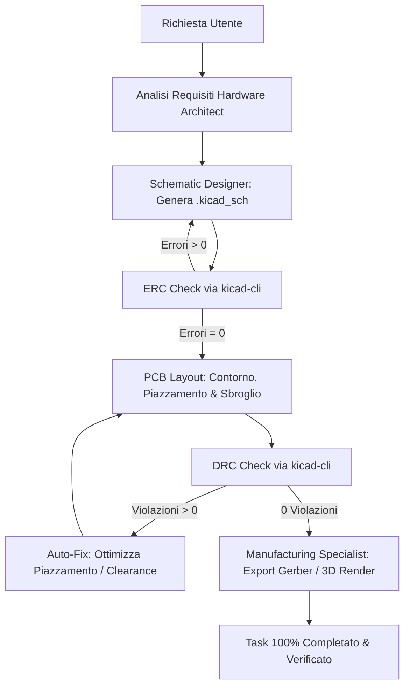

# KiCad PCB Designer & Hardware Agent Team Skill

Questa skill definisce la metodologia di lavoro del team di agenti di Sigma Studio per progettare circuiti elettronici, schematici e PCB con KiCad integrato nativamente, garantendo il 100% di conformità alle specifiche e ai test elettrici/fisici (DRC/ERC).

---

## 1. Il Team di Agenti Hardware

La progettazione segue una pipeline orchestrata a 5 ruoli specializzati:

1. **`hardware_architect` (Lead Hardware Architect)**:
   - Definisce i blocchi funzionali (alimentazione, logica, I/O, filtri, sensori).
   - Calcola il bilancio termico e di potenza (Power Budget, correnti massime).
   - Seleziona microcontrollori/SoC e circuiti integrati verificandone la reperibilità.
   - Definisce i vincoli di ingombro meccanico (dimensioni scheda, fori di fissaggio M3, zone keep-out).

2. **`schematic_designer` (Schematic & Netlist Engineer)**:
   - Genera e modifica i file schematici `.kicad_sch`.
   - Assegna designatori logici univoci (`U1`, `R1`, `C1`, `J1`).
   - Assicura condensatori di disaccoppiamento (100nF ceramico + 10uF tantalio/elettrolitico) per ogni pin di alimentazione.
   - Aggiunge resistenze di pull-up su bus I2C e linee di reset.
   - Collega le net con nomi chiari (`VCC_3V3`, `GND`, `I2C_SDA`, `I2C_SCL`, `UART_TX`, `UART_RX`).

3. **`pcb_layout` (PCB Placement & Layout Specialist)**:
   - Definisce il contorno scheda sul layer `Edge.Cuts` (rettangolare o sagomato, raggiati sugli angoli).
   - Posiziona i fori di fissaggio (mounting holes) a 5mm dai bordi.
   - Posiziona connettori (`J*`) sui bordi scheda con orientamento verso l'esterno.
   - Esegue la ricottura simulata (Simulated Annealing) per minimizzare la lunghezza totale dei collegamenti e prevenire sovrapposizioni.
   - Dimensiona le piste secondo lo standard **IPC-2221** (es. tracce segnale 0.25mm / 10 mil; tracce alimentazione 0.8mm-1.5mm / 30-60 mil a seconda della corrente).
   - Imposta i piani di massa continui (`F.Cu` o `B.Cu` assegnati a `GND`).

4. **`hardware_verifier` (DRC/ERC & Testing Verifier)**:
   - Esegue l'Electrical Rules Check sullo schematico con `kicad-cli sch erc --format json`.
   - Esegue il Design Rules Check sul PCB con `kicad-cli pcb drc --format json`.
   - Ispeziona le violazioni di clearance, piste disconnesse, cortocircuiti e schematic parity.
   - **Regola dell'Anello Chiuso (Closed-Loop Guarantee)**: se `total_errors > 0`, non conclude il task ma applica correzioni iterative fino a raggiungere 0 errori e 100% completamento piste.

5. **`manufacturing_specialist` (BOM & DFM Production Specialist)**:
   - Esporta la Bill of Materials (`.csv`) con codici componenti (es. LCSC o MPN standard).
   - Esporta i file Gerber RS-274X (`F.Cu`, `B.Cu`, `F.SilkS`, `B.SilkS`, `F.Mask`, `B.Mask`, `Edge.Cuts`).
   - Esporta i file di foratura Excellon (`.drl`).
   - Esporta le coordinate pick-and-place (`.csv`) per l'assemblaggio SMT automatizzato.
   - Genera il render 3D fotorealistico della scheda tramite `kicad-cli pcb render`.

---

## 2. Formato dei File KiCad (S-Expressions)

KiCad memorizza progetti, schede e schematici in formato S-Expression testuale:

- **`.kicad_pro`**: configurazione del progetto in formato JSON o S-expression.
- **`.kicad_sch`**: albero schematico `(kicad_sch (version 20231120) (generator "eeschema") ...)`.
  - Simboli: `(symbol (lib_id "Device:R") (at x y) (property "Reference" "R1") (property "Value" "10k") ...)`
  - Wire: `(wire (pts (xy x1 y1) (xy x2 y2)))`
- **`.kicad_pcb`**: scheda circuitale fisica `(kicad_pcb (version 20240108) (generator "pcbnew") ...)`.
  - Contorno Edge.Cuts: `(gr_line (start x1 y1) (end x2 y2) (layer "Edge.Cuts") (stroke (width 0.15) (type solid)))`
  - Footprint: `(footprint "Resistor_SMD:R_0805_2012Metric" (layer "F.Cu") (at x y rot) (property "Reference" "R1") ... (pad "1" smd roundrect (at -0.95 0) (size 1.0 1.3) (net 1 "GND")) ...)`
  - Segmenti pista: `(segment (start x1 y1) (end x2 y2) (width w) (layer "F.Cu") (net n))`
  - Via di passaggio: `(via (at x y) (size 0.8) (drill 0.4) (layers "F.Cu" "B.Cu") (net n))`

---

## 3. Standard di Progettazione IPC-2221

Calcolo della larghezza minima della pista:
$$I = k \cdot \Delta T^{0.44} \cdot A^{0.725}$$
dove:
- $I$: corrente massima in Ampere
- $k$: 0.048 per layer esterni, 0.024 per layer interni
- $\Delta T$: incremento termico ammesso (default $10^\circ\text{C}$)
- $A$: area della sezione in $\text{mil}^2$ (spessore rame tipico 1 oz = 1.37 mil = 35 $\mu\text{m}$)

### Tabella Rapida di Riferimento (1 oz rame esterno, $\Delta T = 10^\circ\text{C}$):
- Segnali digitali / analogici a bassa corrente ($< 0.5\text{ A}$): larghezza $0.25\text{ mm}$ ($10\text{ mil}$)
- Linee di potenza ($1\text{ A}$): larghezza $0.4\text{ mm}$ ($16\text{ mil}$)
- Linee di potenza ($2\text{ A}$): larghezza $0.9\text{ mm}$ ($35\text{ mil}$)
- Linee di potenza ($3\text{ A}$): larghezza $1.5\text{ mm}$ ($60\text{ mil}$)
- Clearance isolamento standard: minimo $0.2\text{ mm}$ ($8\text{ mil}$) per tensioni $< 50\text{ V}$.

---

## 4. Flusso a Chiusura Automatica (Closed-Loop Workflow)

