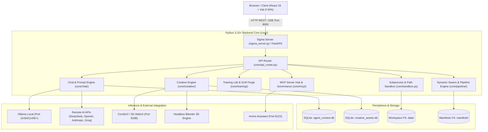
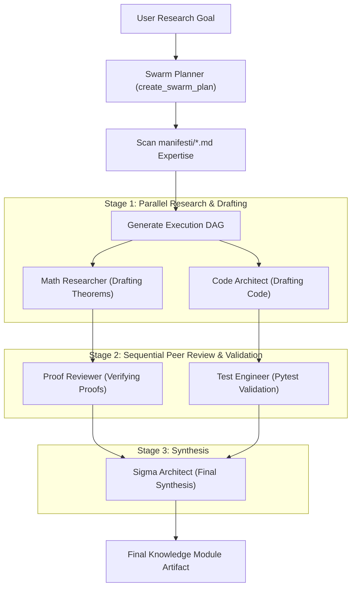
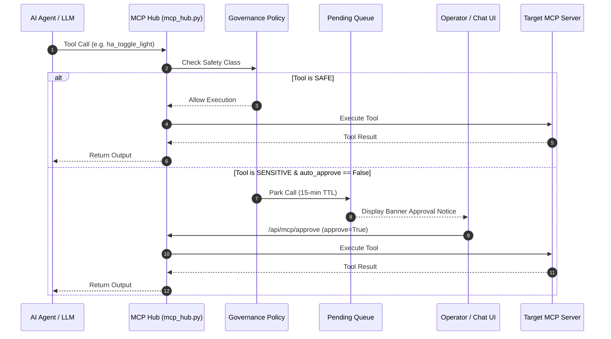
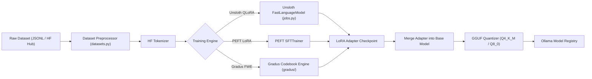

# SIGMA STUDIO — ARCHITECTURE SPECIFICATION & SYSTEM DESIGN

**Version**: 8.0 / 6.2 Refactored  
**Status**: Executable System Reality  
**Primary Tech Stack**: Python 3.10+ (FastAPI / Uvicorn), React 19, Vite 8, PyTorch, Unsloth, HuggingFace, KaTeX, D3.js  

---

## 1. Architectural Principles

Sigma Studio is designed around five primary architectural tenets:

1. **Executable Code as Authority**: System configuration, agent contracts, and workspace files are strictly executable or parseable objects. Documentation reflects runtime realities.
2. **Modular Subsystem Decoupling**: The backend (`core/`) is organized into domain-isolated modules (`chat`, `creative`, `mcp`, `orchestration`, `pipeline`, `training`, `tts`, `integrations`) coordinated through a central API router (`core/api_router.py`).
3. **Whitelisted Path Sandboxing**: Agent execution, file operations, and terminal subprocesses are bounded by strict path whitelists (`core/sandbox.py`) and shlex-isolated execution timeouts (`core/sandbox_manager.py`).
4. **Governed Tool Interoperability**: External tools, hardware devices, and system capabilities interact exclusively via Model Context Protocol (MCP) servers with explicit human-in-the-loop safety gating for sensitive operations.
5. **Hardware-Aware Adaptive Execution**: Training, evaluation, inference, and multi-agent execution dynamically monitor VRAM/RAM telemetry to select optimal precision, batch size, and KV-cache offloading strategies.

---

## 2. High-Level System Architecture



---

## 3. Frontend Architecture

### 3.1 Stack & Technology
- **Framework**: React 19 (`react`, `react-dom` v19.2.4)
- **Build Tool**: Vite 8 (`vite` v8.0.4, `@vitejs/plugin-react` v6.0.1)
- **Styling**: Vanilla CSS (`src/index.css`) with glassmorphism tokens, dark theme `#0e1016` surface, and responsive flex/grid layouts.
- **Rendering & Visualization**:
  - `KaTeX` (`katex.min.css`): Inline ($...$) and block ($$...$$) mathematical rendering.
  - `Mermaid.js` (`mermaid.render()`): Flowcharts, sequence diagrams, and DAG visualizations.
  - `D3.js` (`d3` v7.9.0): Interactive relational knowledge graphs (`MappaArgomenti.jsx`, `TopicGraph.jsx`).
  - `Prism.js` (`prismjs` v1.30.0) + `react-simple-code-editor`: Live syntax-highlighted code editing.
  - `Three.js` (`three` v0.185.1): 3D canvas and mesh visualization.

### 3.2 State Management & Hooks
State is centralized via `AppContext` (`src/contexts/AppContext.jsx`) and broken into modular domain hooks:
- **`useModules`**: Fetches, creates, updates, and deletes workspace module folders via `/api/modules`.
- **`useTasks`**: Task list management, completion status toggling, and `/api/tasks` synchronization.
- **`useTabs`**: Multi-tab workspace manager supporting singleton views (`chat`, `training_lab`, `hardware_lab`, `mcp_hub`, `account`, `skills_hub`) and file tabs (`teoria`, `scripts`, `test`, `viz`, `docs`, `whitepaper`, `image_viewer`).
- **`useFileOps`**: Handles file creation, direct deletion, test script execution (`/api/run_test`), and terminal console streaming.
- **`useModuleOps`**: Modal handlers for module creation and updating.

### 3.3 Chat Engine Architecture & Realtime SSE
The chat interface operates via dedicated hooks in `src/components/Chat/core/`:
- **`useChatCore`**: Central state orchestrator assembling provider configuration, sessions, audio TTS/STT, and execution mode.
- **`useChatStreaming`**: Consumes Server-Sent Events (SSE) from `/api/chat`, strips chain-of-thought `<think>` tags, streams tokens, handles auto-continuation on length truncation, and parses embedded `tool_calls` / `created_files`.
- **`useMcpAutoApprove`**: Synchronizes local state with server governance policy (`/api/mcp/policy`).
- **`useResearchPipeline`**: Drives multi-agent research session decomposition and progress tracking.

### 3.4 Conceptual Component Hierarchy

```text
App (App.jsx)
 ├── AppProvider (AppContext.jsx)
 ├── Sidebar (Sidebar.jsx)
 │    ├── Module Tree & File Navigator
 │    ├── Topic Selector & Quick Launcher
 ├── Workspace (Workspace.jsx)
 │    ├── TabBar (Multi-tab container)
 │    ├── McpStatusBar (Realtime MCP health)
 │    └── Tab View Dispatch:
 │         ├── WelcomeDashboard (Bacheca)
 │         ├── SigmaLabEditor (MD, LaTeX, Py, HTML Viz editor & preview)
 │         ├── ImageViewer (Zoom, Pan, Checkerboard PNG transparency)
 │         ├── ManifestiGallery (Agent Modelfile cards & image update)
 │         ├── ModuleView (Module file sections: teoria, test, viz, docs)
 │         ├── ResearchLabTab (Multi-agent roadmap & micro-tasks)
 │         ├── CreativeStudio (Text2Img, 3D, Material, Video UI)
 │         ├── TrainingLab (Unsloth QLoRA, Autopilot, SLM Forge, Benchmarks)
 │         ├── HardwareLab (VRAM process inventory & hardware metrics)
 │         ├── McpHubTab (12 MCP servers, JSON-RPC console, auto-approve policy)
 │         ├── SkillsHub (Custom skill toggling & app integrations)
 │         └── AccountTab (User profile & local preferences)
 ├── Floating Panels:
 │    ├── ChatPanel (Agent Message list, Input bar, Audio TTS/STT)
 │    ├── TaskFloatingPanel (Task management overlay)
 │    └── HardwareFloatingPanel (Realtime GPU/CPU monitor overlay)
 └── Modals & Notifications:
      ├── ImageLightbox (Fullscreen image zoom & download)
      ├── AIConfig (Model & Provider settings)
      └── ToastNotification (Stackable system alerts)
```

---

## 4. Backend Architecture

### 4.1 Server Infrastructure (`sigma_server.py` & `core/fastapi_app.py`)
- **Primary Web Engine**: FastAPI running on Uvicorn ASGI server (`0.0.0.0:8000`).
- **Startup Lifecycle (`_startup_sequence`)**:
  1. Multi-GPU environment configuration (`_apply_hardware_env()`).
  2. Automatic build check for React static assets (`sigma_studio/dist/`).
  3. Workspace module metadata indexing (`rebuild_modules_meta()`).
  4. Initialization of `sigma-router` model.
  5. Recovery of orphaned training background jobs (`reconcile_active_jobs()`).
- **Static Mounting**:
  - `/data` -> Workspace files (`data/`)
  - `/images` -> Avatars & system assets (`images/`)
  - `/manifesti` -> Agent manifests (`manifesti/`)

### 4.2 API Router & Endpoint Reference Table

All API requests pass through `core/api_router.py`, which dispatches paths to core functions:

#### GET Endpoint Reference
| Path | Function | Description |
|:---|:---|:---|
| `/api/modules` | `handle_api_modules` | Returns list of active modules and file structure. |
| `/api/topics` | `handle_api_topics` | Returns topic list and module counts. |
| `/api/tasks` | `handle_api_tasks_get` | Retrieves workspace tasks. |
| `/api/get_file` | `handle_get_file` | Reads content of specified file path. |
| `/api/list_manifesti` | `handle_list_manifesti` | Lists agent Markdown Modelfiles in `manifesti/`. |
| `/api/knowledge_db` | `handle_knowledge_db` | Returns relational knowledge node tree. |
| `/api/config` | `handle_api_config_get` | Returns system config (API keys masked). |
| `/api/ollama_models` | `handle_api_ollama_models` | Fetches local Ollama model registry. |
| `/api/agents` | `handle_agents_list` | Returns registered agents & metadata. |
| `/api/research/list` | `handle_research_list` | Lists active research sessions. |
| `/api/training/datasets` | `handle_training_list_datasets` | Lists local fine-tuning datasets. |
| `/api/training/jobs` | `handle_training_list_jobs` | Lists fine-tuning job statuses. |
| `/api/training/hardware` | `handle_training_hardware` | Returns GPU VRAM, RAM, and CPU telemetry. |
| `/api/hardware/status` | `handle_hardware_status` | Returns system hardware usage metrics. |
| `/api/mcp/servers` | `handle_mcp_servers` | Returns registered MCP server statuses. |
| `/api/mcp/tools` | `handle_mcp_tools` | Aggregates all registered MCP tools. |
| `/api/creative/assets` | `handle_creative_assets` | Queries creative asset vault. |
| `/api/creative/backends/status` | `handle_creative_backends_status` | Status of ComfyUI, SD WebUI, Blender. |

#### POST Endpoint Reference
| Path | Function | Description |
|:---|:---|:---|
| `/api/chat` | `handle_chat` | Streams LLM completion via Server-Sent Events (SSE). |
| `/api/chat/orchestrate` | `handle_chat_orchestrate` | Launches multi-agent parallel execution. |
| `/api/swarm/plan` | `handle_swarm_plan` | Generates dynamic agent swarm execution DAG. |
| `/api/swarm/execute` | `handle_swarm_execute` | Executes multi-agent swarm DAG. |
| `/api/create_file` | `handle_create_file` | Creates whitelisted file in workspace. |
| `/api/run_test` | `handle_run_test` | Executes Python test script in sandbox. |
| `/api/mcp/rpc` | `handle_mcp_rpc` | JSON-RPC 2.0 gateway for MCP tools. |
| `/api/mcp/approve` | `handle_mcp_approve` | Approves parked sensitive MCP tool call. |
| `/api/training/job/create` | `handle_training_job_create` | Initializes training job configuration. |
| `/api/training/job/start` | `handle_training_job_start` | Spawns background training process. |
| `/api/training/benchmark/run` | `handle_training_benchmark_run` | Launches official benchmark evaluation. |
| `/api/creative/generate` | `handle_creative_generate` | Text-to-Image / Img2Img generation. |
| `/api/creative/3d` | `handle_creative_3d` | Generates 3D mesh (GLB/OBJ). |
| `/api/creative/render` | `handle_creative_render` | Renders 3D scene via headless Blender. |

---

## 5. Agent Architecture & Swarm Orchestration

### 5.1 Agent Definitions & Manifestos
Agent definitions are stored in `agents_meta.json` and linked to Markdown Modelfiles in `manifesti/`:
- **`sigma_architect`**: Lead system architect and coordinator.
- **`code_architect`**: Software engineering & Python validation specialist.
- **`math_researcher`**: Mathematician, theorem prover & Latex writer.
- **`test_engineer`**: Pytest script generator & verification specialist.
- **`viz_designer`**: D3.js and HTML visualization designer.
- **`proof_reviewer`**: Academic proof & logical consistency reviewer.

### 5.2 Dynamic Swarm DAG Orchestrator (`core/pipeline/dynamic_swarm.py`)



---

## 6. MCP Architecture & Governance

### 6.1 Governance Policy (`core/mcp/governance.py`)



---

## 7. AI & Model Subsystem

### 7.1 Multi-Provider Resolution Logic
When an LLM call is initiated, `core/ai_providers.py` resolves the endpoint:
1. **Ollama**: Sends HTTP POST to `http://localhost:11434/api/generate` or `/api/chat`.
2. **DeepSeek**: Sends HTTP POST to `https://api.deepseek.com/chat/completions`.
3. **OpenAI**: Sends HTTP POST to `https://api.openai.com/v1/chat/completions`.
4. **Anthropic**: Sends HTTP POST to `https://api.anthropic.com/v1/messages`.
5. **Groq**: Sends HTTP POST to `https://api.groq.com/openai/v1/chat/completions`.
6. **OpenRouter**: Sends HTTP POST to `https://openrouter.ai/api/v1/chat/completions`.

### 7.2 Intent Classification Router (`Ailo-152M`)
- **File**: `core/router_trainer.py`
- **Purpose**: Fast local classification (~100ms) of user queries into simple responses vs multi-step autonomous task execution loops.

---

## 8. Training Lab & Gradus Fine-Tuning Engine

### 8.1 Fine-Tuning Pipeline



---

## 9. Creative Engine & Asset Graph Architecture

### 9.1 Asset Graph Schema (`data/creative/creative_assets.db`)
- **`assets` Table**: Stores `asset_id`, `type` (image, mesh, material, video), `name`, `thumbnail`, `metadata_json`, `created_at`.
- **`asset_versions` Table**: Version history, file roles (albedo, normal, mesh, render), and parameters.
- **`asset_edges` Table**: Tracks DAG lineage (parent asset -> derived child asset).

---

## 10. Data & Persistence Model

| Storage Mechanism | Path / Connection | Data Stored |
|:---|:---|:---|
| **SQLite DB** | `agent_context.db` | Context key-value share, chat message logs, research sessions. |
| **SQLite DB** | `data/creative/creative_assets.db` | Creative asset graph, version history, DAG lineage edges. |
| **JSON Store** | `config.json` | Hardware settings, provider API keys, MCP auto-approve policy. |
| **JSON Store** | `agents_meta.json` | Agent definitions, roles, models, temperature, context length. |
| **JSON Store** | `modules_meta.json` | Index of workspace topics, modules, sections, and file paths. |
| **FS Files** | `data/<topic>/<module>/<section>/<file>` | Workspace Markdown, Python scripts, D3 HTML visualizations. |

---

## 11. Security Boundaries & Risk Matrix

### Security Boundaries
- **Path Whitelist (`core/sandbox.py`)**: `_is_path_allowed()` enforces strict write/read boundaries. Access outside whitelisted roots (`data/`, `manifesti/`, `scratch/`, `sigma_studio/`, `core/`) returns HTTP 403.
- **AST Static Code Checking**: Code generated by AI agents is parsed via Python `ast.parse()` to detect structural anomalies prior to execution.
- **Subprocess Isolation**: Subprocess calls use explicit execution timeouts and `shlex.split` arguments without `shell=True`.

### Security Risk Matrix
- 🔴 **Unauthenticated REST API**: `/api/*` endpoints bind to `0.0.0.0:8000` by default without bearer token authentication.
- 🔴 **Committed Secrets in Local Config**: `config.json` may contain active API keys if not copied from `config.example.json`.

---

## 12. Implemented vs. Planned Feature Status Matrix

| System Component | Implemented | Partial | Planned | Evidence |
|:---|:---:|:---:|:---:|:---|
| **FastAPI ASGI Backend** | ✅ | | | `core/fastapi_app.py` |
| **React 19 SPA Frontend** | ✅ | | | `sigma_studio/src/App.jsx` |
| **Multi-Provider AI (Ollama/DeepSeek/OpenAI)** | ✅ | | | `core/ai_providers.py` |
| **12 Built-in MCP Servers** | ✅ | | | `core/mcp/*.py` |
| **Home Assistant Integration** | ✅ | | | `core/mcp/homeassistant_server.py` |
| **Dynamic Swarm DAG Engine** | ✅ | | | `core/pipeline/dynamic_swarm.py` |
| **Unsloth QLoRA & SLM Forge** | ✅ | | | `core/training/jobs.py`, `forge.py` |
| **Gradus FWE Weight Generator** | ✅ | | | `gradus/` package |
| **Asset Graph SQLite Vault** | ✅ | | | `core/creative/asset_graph.py` |
| **Headless Blender 3D Rendering** | ✅ | | | `core/creative/three_d/blender_bridge.py` |
| **In-Chat & Workspace Image Viewer** | ✅ | | | `src/components/Workspace/ImageViewer.jsx` |
| **RESTful DELETE/PATCH Routes** | | ⚠️ | | `core/api_router.py:L287` (Stubs) |
| **Docker & Docker Compose** | | | ❌ PLANNED | No `Dockerfile` present |
| **CI/CD GitHub Actions** | | | ❌ PLANNED | No `.github/workflows` present |
| **Native Raspberry Pi / ARM64** | | | ❌ PLANNED | No ARM64 build manifests |
