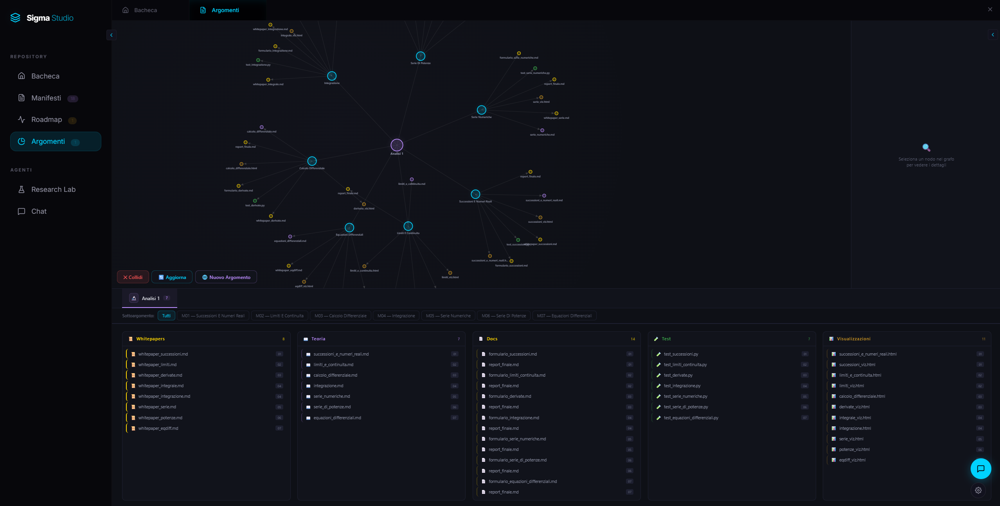
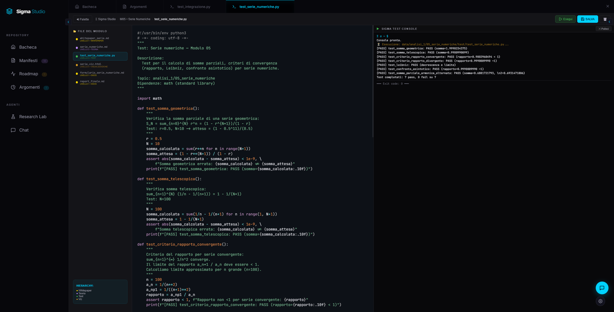
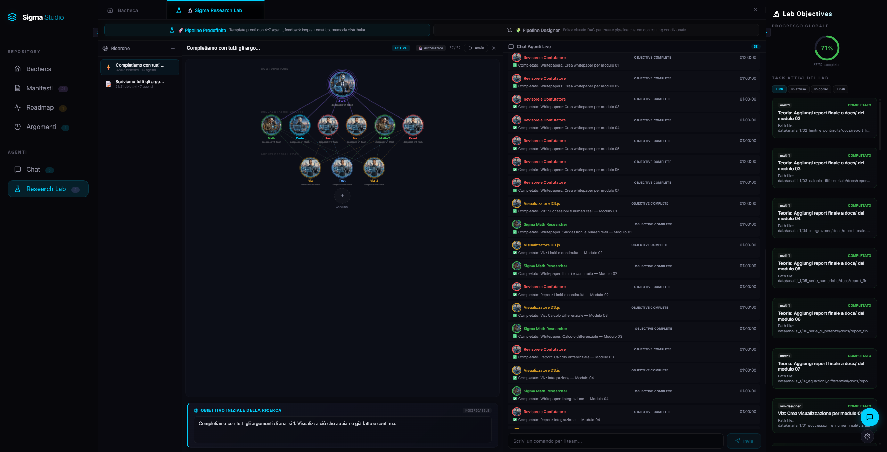
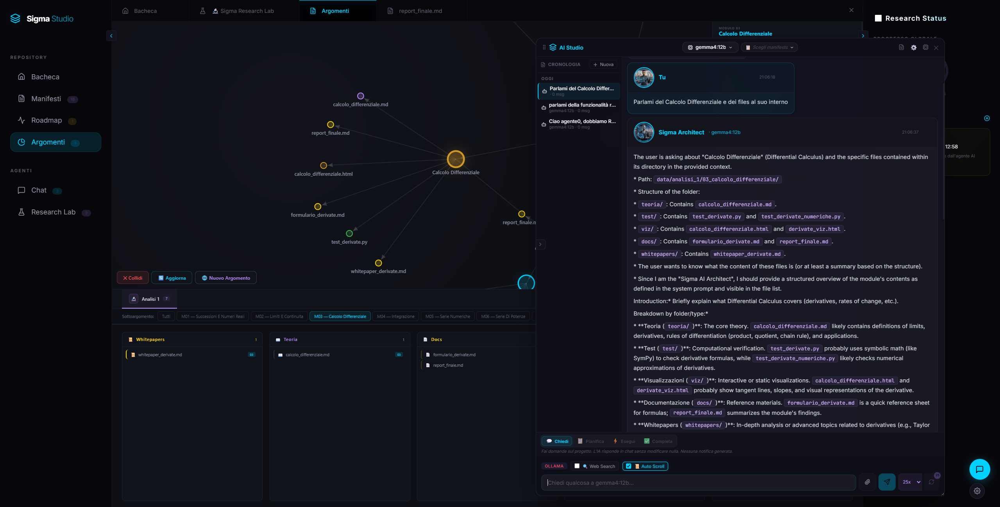
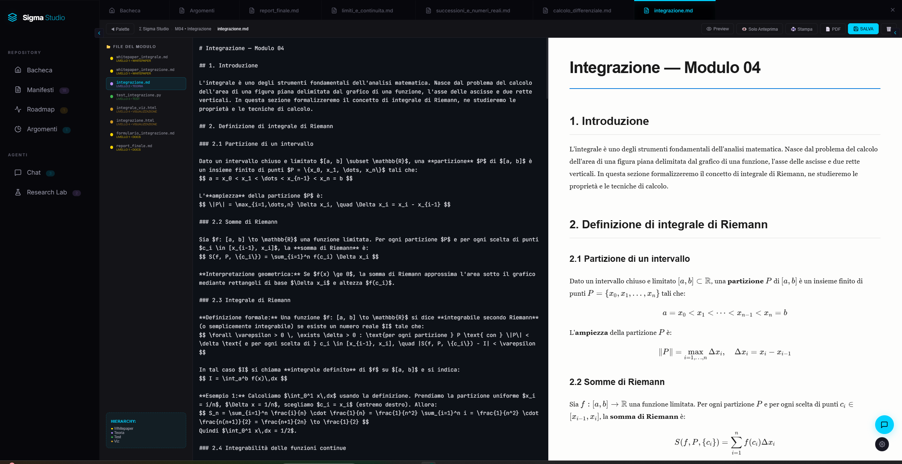
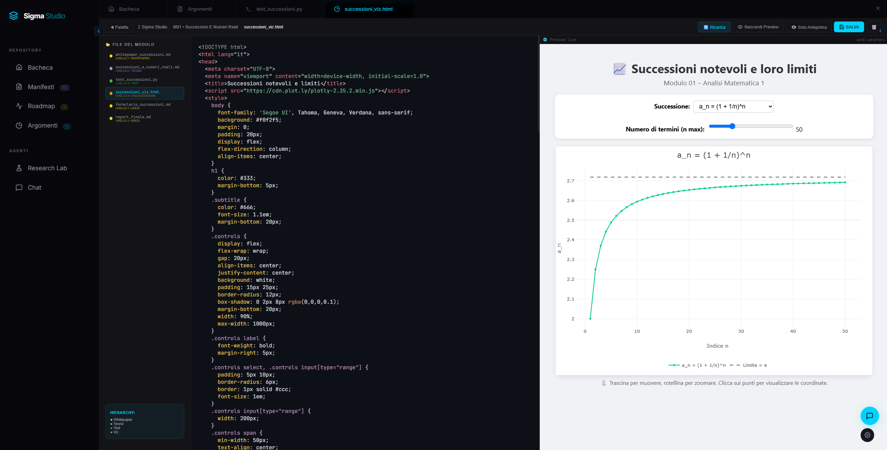

<p align="center">
  <h1 align="center">🧬 Σ-SIGMA Studio</h1>
  <p align="center"><strong>AI-Native Platform for Cognitive Orchestration & Research Automation</strong></p>
  <p align="center">
    <a href="#"></a>
    <a href="#"></a>
    <a href="#"></a>
    <a href="#"></a>
    <a href="#"></a>
    <a href="#"></a>
    <a href="#"></a>
  </p>
</p>

---

## 🚀 What is Sigma Studio?

**Sigma Studio is a cognitive orchestration engine** — an executable environment where AI agents create, verify, document, and organize knowledge, governed by Modelfile manifests that define their behavior.

Imagine a **team of specialized AI agents** (a mathematician, an architect, a tester) working 24/7 on your research, tracking every action, testing every theorem, and building a navigable knowledge graph of everything they produce.

**This is Sigma Studio.**

### Key Differentiators

| Feature | Why It Matters |
|:--------|:---------------|
| 🧠 **Multi-Provider AI** | Ollama (local), DeepSeek, OpenAI, Anthropic, Groq, OpenRouter — you choose the brain |
| 📜 **Manifesto System** | Every agent has a "code of conduct" written as an Ollama Modelfile. Not human instructions — executable contracts |
| 🔬 **Automated Research** | AI explores, proves, refutes, and documents — without you lifting a finger |
| 🏗️ **Full-Stack AI** | From academic theory to working software: theorems → tests → D3.js visualizations → whitepapers |
| 🔒 **Sandbox Security** | Every operation is confined to whitelisted paths. No agent touches system files |
| 🧩 **Modular Architecture** | Python backend + React 19 frontend + Multi-provider AI: fully composable |

---

## 🖼️ Screenshots

<p align="center">
  
  
</p>
<p align="center">
  <em>Mappa degli Argomenti con Grafo Relazionale D3.js (sinistra) e Test Automatici / Validazione dei moduli (destra).</em>
</p>

<p align="center">
  
  
</p>
<p align="center">
  <em>Research Lab con la pianificazione in micro-task (sinistra) e la Chat Multi-Agente con integrazione dei Manifesti (destra).</em>
</p>

<p align="center">
  
  
</p>
<p align="center">
  <em>Sigma Lab Editor per la redazione e modifica dei file (sinistra) e le Visualizzazioni interattive ed editoriali D3.js generate dagli agenti (destra).</em>
</p>

### 💡 From a Single Prompt to a Complete Knowledge Base

Tutti i file di teoria, i formulari, i grafici interattivi D3.js e gli script di test visibili negli screenshot sono stati generati a partire da **un unico, singolo prompt iniziale** inserito nel **Research Lab**:

> *"Scriviamo tutti gli argomenti e i sottoargomenti trattati in un corso di Analisi 1 matematica ingegneria con dimostrazioni, formulari, esercizi in files separati e tutto il necessario a comprendere perfettamente la materia"*

Da questo singolo input, il coordinatore **Sigma Architect** e la pipeline di agenti hanno:
1. **Analizzato il dominio** e suddiviso la roadmap in 7 moduli sequenziali (dalle Successioni alle Equazioni Differenziali).
2. **Generato la teoria** in file Markdown arricchiti con formule LaTeX e definizioni rigorose.
3. **Scritto ed eseguito i test unitari Python** (`test-engineer`) con validazione matematica e self-healing automatico in caso di errori.
4. **Disegnato visualizzazioni interattive** (`viz-designer`) pronte da navigare nel Sigma Lab.
5. **Redatto whitepaper** e report di validazione formali per certificare il lavoro.

---

## 💬 The Power of AI Chat & Orchestration

La chat di Sigma Studio non è un semplice chatbot, ma un pannello di controllo cognitivo flessibile che vanta funzionalità avanzate:

- **4 Modalità Operative**:
  - **Ask**: Spiegazioni rapide e domande teoriche senza modificare il workspace.
  - **Plan**: Scomposizione di obiettivi complessi in micro-task salvati direttamente nella Roadmap.
  - **Execute**: Modifica e scrittura di file sul disco in tempo reale con controllo del Sandbox.
  - **Complete Task**: Risoluzione assistita o autonoma di compiti specifici della Roadmap.
- **Associazione del Manifesto**: Cambio al volo del comportamento dell'agente associando i Manifesti di configurazione, con ripristino automatico quando si naviga tra sessioni diverse.
- **Tracciamento in Tempo Reale**: Ogni azione (creazione di file, esecuzione di comandi, test di validazione) lascia una notifica strutturata per la massima trasparenza operativa.

---

## 🤝 Open to Contributions!

Sigma Studio è un progetto **open-source** in continua evoluzione e accoglie con entusiasmo contributi da parte della community! Puoi contribuire in molti modi:

- 📜 **Nuovi Manifesti**: Crea e condividi nuovi ruoli di agenti (`manifesti/*.md`) specializzati in campi scientifici, ingegneristici o creativi.
- 🎨 **Miglioramenti UI/UX**: Estendi il design system in vetro (glassmorphism) in React 19.
- 🔧 **Estensioni Backend**: Aggiungi nuovi provider AI, ottimizza la pipeline di test o arricchisci le API REST.
- 🔬 **Pipeline di Ricerca**: Integra nuovi strumenti di validazione o template di orchestrazione multi-agente.

---

## ⚙️ Quick Start

### Prerequisites

- **Python 3.10+**
- **Node.js / npm**
- **Ollama** (for local AI — [download here](https://ollama.com))

### Setup

```bash
# 1. Clone the repository
git clone https://github.com/your-org/sigma-studio.git
cd sigma-studio

# 2. Install Python dependencies
pip install -r requirements-backend.txt

# 3. Install frontend dependencies
cd sigma_studio && npm install && cd ..

# 4. Start the backend (automatically builds frontend)
python sigma_server.py

# 5. (Optional) Start frontend in dev mode
cd sigma_studio && npm run dev
```

The backend is now live at **http://localhost:8000** and the frontend at **http://localhost:5173**.

### Quick Verification

```bash
# Verify core modules
python -c "from core.sandbox import is_path_allowed; from core.ai_providers import load_ai_config; print('✅ System OK')"

# Verify API
curl http://localhost:8000/api/tasks

# Create an Ollama model from a manifesto
curl -X POST http://localhost:8000/api/create_model \
  -H "Content-Type: application/json" \
  -d '{"name": "sigma_architect", "modelfile": "FROM llama3.2\nSYSTEM \"\"\"You are a software architect...\"\"\""}'
```

---

## 🧠 Multi-Provider AI

Sigma Studio supports **6 AI providers** dynamically configurable via `config.json`:

| Provider | Type | Setup |
|:---------|:-----|:-------|
| **Ollama** 🦙 | Local (free) | `http://localhost:11434` |
| **DeepSeek** 🔍 | Cloud API | `API Key` |
| **OpenAI** 🤖 | Cloud API | `API Key` |
| **Anthropic (Claude)** 🟣 | Cloud API | `API Key` |
| **Groq** ⚡ | Cloud API | `API Key` |
| **OpenRouter** 🌐 | Cloud API (multi-model) | `API Key` |

### 4 Chat Modes

> Sigma Principle: **"A notification not left is an action that never happened."**

| Mode | Backend Params | What It Does | Notifications? |
|:-----|:--------------|:-------------|:---------------|
| 💬 **Ask** | `allow_actions=false` | AI responds without modifying anything | None (chat only) |
| 📋 **Plan** | `planning_mode=true` | Analyzes a goal and creates tasks in the Roadmap | ✅ Each task gets a creation notification |
| ⚡ **Execute** | `allow_actions=true` | AI creates, modifies, or deletes files | ✅ **Automatic**: every file action generates a notification |
| ✅ **Complete Task** | `execute_task_id` + `allow_actions=true` | Executes a specific task from the Roadmap and marks it done | ✅ Notifications for every action + completion marking |

---

## 📜 Manifesto System

AI agents aren't black boxes. They're defined by **Ollama Modelfiles** that specify:
- **Identity**: "You are a mathematician specialized in number theory..."
- **Rules**: "Never modify files outside `data/`..."
- **Protocol**: "Before acting, analyze the context..."
- **Parameters**: Temperature, context window, conversation template

### Available Agents

| Agent | Base Model | Version | Role |
|:------|:-----------|:--------|:-----|
| `sigma_architect.md` | llama3.2 | **v6.0** | Software Architect — full-stack engineer, main orchestrator |
| `math1.md` | llama3.2 | v5.0 | Math Research Assistant — template for new agents |

### Create a New Agent in 30 Seconds

```bash
# 1. Create a manifesto file
cat > manifesti/my_agent.md << 'EOF'
FROM llama3.2
SYSTEM """
You are an agent specialized in molecular biology...
Rules:
- Only modify files within data/biology/
- Use exclusively Ollama provider for research
- Every discovery must generate a notification in tasks.json
"""
PARAMETER temperature 0.3
PARAMETER num_ctx 32768
EOF

# 2. Load the model into Ollama
curl -X POST http://localhost:8000/api/create_model \
  -H "Content-Type: application/json" \
  -d "{\"name\": \"my_agent\", \"modelfile\": \"$(cat manifesti/my_agent.md)\"}"
```

---

## 🏛️ Architecture

```
Sigma_Studio/
│
├── sigma_server.py                 ← Python Backend — REST API + AI orchestration
├── config.json                     ← Multi-provider AI configuration
├── .gitignore                      ← Ignores node_modules, .env, dist, data/
├── LICENSE                         ← GPL v3 / Commercial License
├── README.md                       ← This file
│
├── core/                           ← Backend modules (separation of concerns)
│   ├── sandbox.py                  ← Path validation & whitelist
│   ├── ai_providers.py             ← Config + provider resolver + API calls
│   ├── api_router.py               ← HTTP route mapping
│   ├── chat_handler.py             ← Chat orchestration + planning modes
│   ├── config_handler.py           ← Config CRUD
│   ├── data_handler.py             ← Data operations
│   ├── file_handler.py             ← File CRUD + sandbox
│   ├── loop_handler.py             ← AI action loop
│   ├── pipeline_engine.py          ← DAG pipeline execution engine
│   ├── context_broker.py           ← SQLite shared context between agents
│   ├── agent_orchestrator.py       ← Multi-agent parallel orchestration
│   ├── agent_registry.py           ← Agent metadata management
│   ├── module_handler.py           ← Module CRUD
│   └── task_handler.py             ← Task CRUD + notifications
│
├── sigma_studio/                   ← React 19 Frontend (Vite)
│   ├── index.html                  ← Entry point
│   ├── vite.config.js              ← Proxy /api/* → localhost:8000
│   └── src/
│       ├── main.jsx                ← React mount (StrictMode)
│       ├── App.jsx                 ← Global state orchestrator
│       ├── components/
│       │   ├── Sidebar.jsx         ← Module tree navigation
│       │   ├── Workspace.jsx       ← Central tab system
│       │   ├── Dashboard.jsx       ← Roadmap task cards
│       │   ├── Chat/               ← AI Chat (4 operating modes)
│       │   │   ├── core/           ← Hooks: useChatCore, useResearchPipeline, usePipelineDesigner
│       │   │   └── layouts/        ← Floating panel & workspace tab
│       │   ├── SigmaLab/           ← Multi-format editor (Markdown, D3 viz, code runner)
│       │   └── Workspace/          ← Sub-components (ManifestiGallery, ModuleView, etc.)
│       └── styles/                 ← Modular CSS (glass-morphism dark theme)
│
├── data/                           ← Knowledge Base (sandbox for AI agents)
└── scratch/                        ← Temporary workspace for experiments
```

---

## 🔗 API Reference

| Method | Endpoint | Function |
|:-------|:---------|:---------|
| `GET` | `/api/modules` | List modules with files by category |
| `GET` | `/api/topics` | Topics with parent/child hierarchy |
| `GET` | `/api/tasks` | Roadmap + notifications |
| `GET` | `/api/get_file?path=...` | Read file (sandbox-safe) |
| `GET` | `/api/list_manifesti` | List available AI agents |
| `GET` | `/api/config` | AI config (without API keys) |
| `GET` | `/api/ollama_models` | Installed Ollama models |
| `POST` | `/api/tasks` | Save tasks.json |
| `POST` | `/api/create_file` | Create/overwrite file |
| `POST` | `/api/chat` | AI Chat (4 modes) |
| `POST` | `/api/chat/orchestrate` | Multi-agent orchestration |
| `POST` | `/api/chat/pipeline/start` | Start DAG pipeline execution |
| `POST` | `/api/create_model` | Create Ollama model from Modelfile |
| `POST` | `/api/run_test` | Execute Python/Node script |
| `POST` | `/api/create_topic` | New research topic |
| `POST` | `/api/create_module` | New module in a topic |

---

## 🤝 Contributing

Sigma Studio is licensed under a **Dual License (GPL v3 / Commercial)**. We welcome contributions of all kinds:

- 🐛 **Report bugs** — open a GitHub issue
- 💡 **Propose features** — discussions and PRs welcome
- 🧠 **Create new AI agents** — Modelfile manifests are easy to write
- 📚 **Add research topics** — the modular structure makes it immediate
- 🎨 **Improve UI/UX** — React 19 components are well-isolated
- 🔧 **Extend the backend** — new API endpoints, providers, sandbox features

### Development Setup

```bash
# Clone and install as above, then:
cd sigma_studio && npm run dev  # Hot-reload frontend
python sigma_server.py          # Auto-builds + serves on :8000
```

### Project Structure for Contributors

- `core/` — Python modules, each < 600 lines, single responsibility
- `sigma_studio/src/components/` — React components, one file per component
- `sigma_studio/src/hooks/` — Custom React hooks for data fetching
- `sigma_studio/src/styles/` — Modular CSS files per section

---

## 📜 License

This project is dual-licensed under:
1. **GNU GPL v3**: For community, open-source, research, and educational use.
2. **Commercial License**: For companies, proprietary products, and closed-source software.

```
                 SigmaStudio
                     |
        +------------+------------+
        |                         |
     GPL v3                  Commercial License
        |                         |
 Comunità, ricerca          Aziende, prodotti chiusi
 gratis                     pagamento
```

For inquiries regarding commercial licensing, please contact Diego Saitta.
See the [LICENSE](LICENSE) file for the full licensing terms.

---

> *"A system is well designed when an AI can understand it without external instructions."* 
> *"A theorem is not proven until it has been refuted, corrected, and refuted again."*
> *"A notification not left is an action that never happened."*
> *"Separate responsibilities, compose modules, maintain the sandbox."*
> — Sigma Principles

---

<p align="center">
  <strong>⭐ If Sigma Studio changed the way you do research, leave a star on GitHub!</strong>
</p>