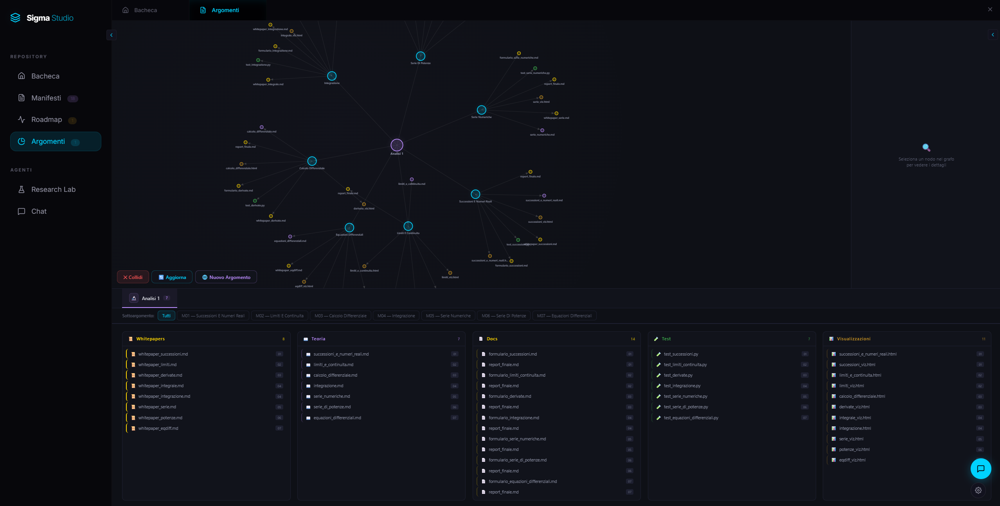
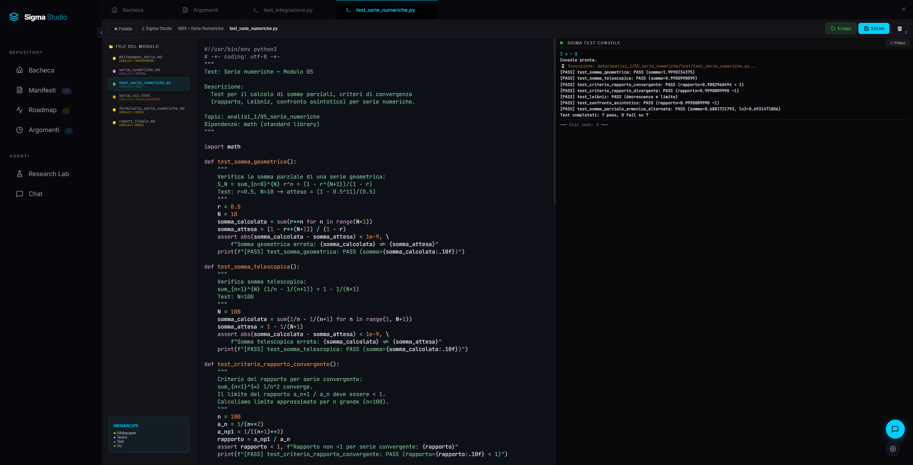
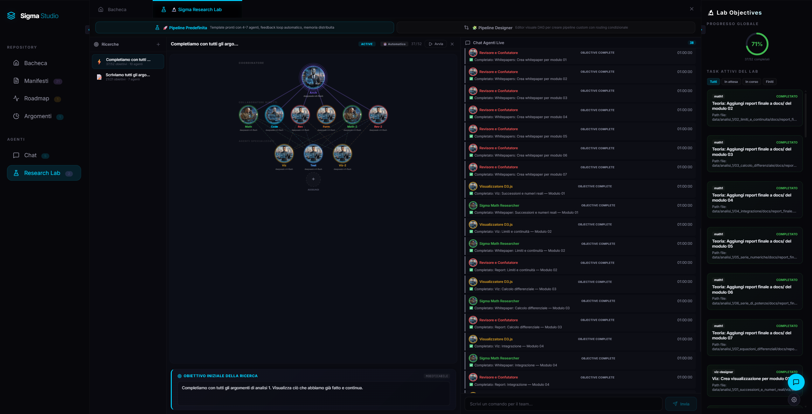
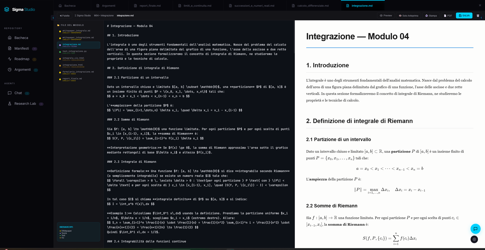
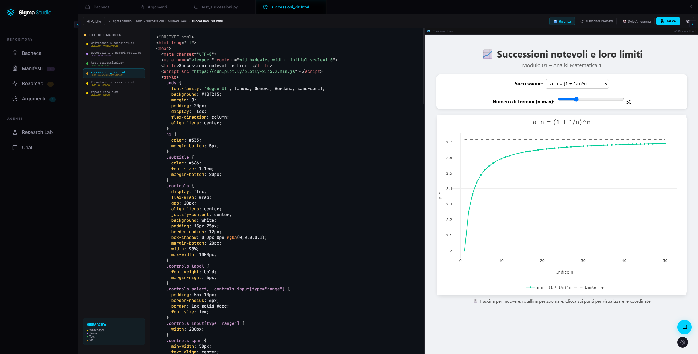
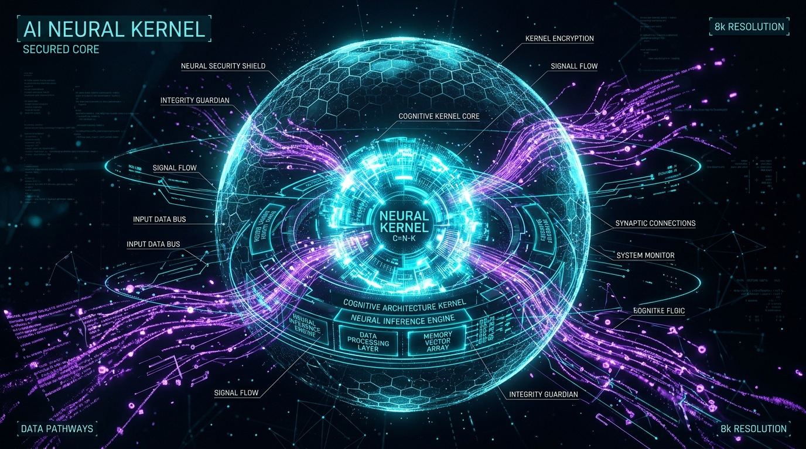

<p align="center">
  <h1 align="center">🧬 Σ-SIGMA Studio</h1>
  <p align="center"><strong>Piattaforma AI-Native per l'Orchestrazione Cognitiva, il Fine-Tuning di Modelli e l'Automazione della Ricerca Multimodale</strong></p>
  <p align="center">
    <a href="#"></a>
    <a href="#"></a>
    <a href="#"></a>
    <a href="#"></a>
    <a href="#"></a>
  </p>
</p>

---

## 🚀 Cos'è Sigma Studio?

<p align="center">
  
</p>

**Sigma Studio è un Kernel di Orchestrazione Cognitiva eseguibile** — un ambiente integrato in cui modelli linguistici ed agenti AI creano, verificano, documentano e organizzano la conoscenza. Operando su un backend **Python 3.10+ (FastAPI)** e un frontend **React 19 + Vite 8**, la piattaforma trasforma semplici prompt iniziali in interi moduli di conoscenza certificati da script di test, formulari LaTeX, visualizzazioni D3.js e report accademici.

Come un sistema operativo orchestra processi e periferiche, Sigma Studio utilizza gli LLM come unità di elaborazione (CPU), i **Manifesti Modelfile** (`manifesti/*.md`) come contratti vincolanti di sistema, il **protocollo MCP (Model Context Protocol)** come bus I/O e la **Sandbox protetta** (`data/`) per confinare la memoria computazionale.

---

## 🖼️ Anteprima e Possibilità di Utilizzo

Tutte le funzionalità principali di Sigma Studio sono corredate da interfacce dedicate:

### 1. Grafo Relazionale & Validazione dei Moduli
<p align="center">
  
  
</p>
<p align="center">
  <em>Grafo relazionale force-directed D3.js per esplorare argomenti e moduli (sinistra) e sistema di esecuzione dei test automatizzati Pytest con console integrata (destra).</em>
</p>

- **Grafo Relazionale D3.js**: Visualizza graficamente le dipendenze tra argomenti e sotto-moduli con nodi interattivi colorati per dominio.
- **Validazione Computazionale**: Ogni modulo include script Python di test eseguiti in un ambiente protetto con self-healing automatico dei fallimenti.

---

### 2. Research Lab & Chat Multi-Agente
<p align="center">
  
  
</p>
<p align="center">
  <em>Research Lab per la scomposizione automatica di obiettivi in micro-task (sinistra) e Chat AI con supporto ai Manifesti Modelfile (destra).</em>
</p>

- **Research Lab**: Trasforma un singolo obiettivo scientifico in una roadmap di micro-task eseguiti in parallelo da agenti specializzati (Matematico, Programmatore, Revisore, Visualizzatore).
- **AI Chat & Modalità Operative**: Interfaccia conversazionale con 4 modalità (`Ask`, `Plan`, `Execute`, `Complete Task`) per operare direttamente sui file del workspace.

---

### 3. Sigma Lab Editor & Visualizzazioni D3.js
<p align="center">
  
  
</p>
<p align="center">
  <em>Sigma Lab Editor con sintassi PrismJS, anteprima KaTeX e Mermaid (sinistra) e rendering delle visualizzazioni D3.js/HTML (destra).</em>
</p>

- **Editor Scientifico Unificato**: Redazione in Markdown con rendering istantaneo di formule KaTeX ($...$ e $$...$$), diagrammi Mermaid e codice Python.
- **Visualizzazioni Interattive**: Sandbox iFrame per eseguire grafica interattiva generata automaticamente dagli agenti AI.

---

### 4. Training Lab — Fine-Tuning & Benchmarks
<p align="center">
  
  
</p>
<p align="center">
  <em>Ciclo Autopilota per l'ottimizzazione automatica degli iperparametri (sinistra) e Valutazione su 11 Suite Ufficiali di Benchmark (destra).</em>
</p>

- **Autopilota Unsloth QLoRA**: Ottimizzazione automatica dei modelli locali su compiti specifici con analisi statistica del miglioramento.
- **Motore Benchmark Ufficiale**: Valutazione su 11 suite standard (MMLU, GSM8K, HumanEval, ARC, BBH, ecc.) con logging dettagliato JSONL.

---

### 5. MCP Server Hub & Forgia SLM
<p align="center">
  
  
</p>
<p align="center">
  <em>MCP Server Hub con governance delle chiamate e console JSON-RPC (sinistra) e Forgia SLM per addestrare modelli italiani da zero (destra).</em>
</p>

- **MCP Server Hub**: 12 server MCP integrati (Memory, Developer, Hardware, Training, Inference, Network, Benchmark, Creative, Home Assistant, Email, Messaging, Calendar) con sistema di approvazione umana per le chiamate sensibili.
- **Forgia SLM**: Addestramento da zero e distillazione di Small Language Models (SLM) in italiano con esportazione in formato GGUF e registrazione automatica su Ollama.

---

### 6. Training Studio & Pipeline DAG Designer
<p align="center">
  
  
</p>
<p align="center">
  <em>Wizard guidato per il fine-tuning (sinistra) e Designer visuale di pipeline multi-agente DAG (destra).</em>
</p>

- **Training Studio Guidato**: Procedura passo-passo per importare dataset HuggingFace, configurare LoRA e convertire i pesi.
- **Pipelines Lab (DAG Designer)**: Progettazione visuale a nodi di workflow complessi con branching condizionale e self-healing.

---

### 7. Creative Studio, Visualizzatore Immagini & Home Assistant

- **Creative Studio**: Generazione Text-to-Image, Img2Img, Inpainting, rimozione sfondo (RemBG), segmentazione SAM, mappe PBR per materiali, sintesi video AnimateDiff e rendering 3D tramite **Blender in modalità headless**.
- **Anteprima Immagini Inline & Image Viewer**: Visualizzazione delle immagini generate direttamente in chat con lightbox full-screen e scheda dedicata `ImageViewer` nel workspace per zoom, pan e sfondo a scacchiera per la trasparenza PNG.
- **Integrazione Home Assistant**: Server MCP nativo per connettersi ad istanze Home Assistant tramite REST/WebSocket API per la gestione di luci, clima, automazioni e stream telecamere.
- **Hardware Lab & Controllo VRAM**: Monitoraggio in tempo reale di GPU VRAM, RAM, CPU e gestione dei processi GPU con terminazione selettiva dei PID orfani.

---

### 8. Architettura del Kernel Cognitivo & Dynamic Swarm

<p align="center">
  
  
</p>
<p align="center">
  <em>Schema dell'Architettura Kernel Cognitivo (sinistra) e Rappresentazione del Swarm Multi-Agente (destra).</em>
</p>

---

## 🛠️ Struttura del Repository

```text
Sigma_Studio/
├── sigma_server.py             # Entrypoint server (FastAPI / Uvicorn)
├── config.json                 # Configurazione di produzione (Provider, MCP, Creative, Hardware)
├── config.example.json         # Template di configurazione
├── requirements.txt            # Dipendenze Python (FastAPI, PyTorch, Transformers, PEFT, Unsloth, ecc.)
├── install_dependencies.bat    # Script Windows di installazione automatica (.venv, pip, npm build)
├── sigma_studio.bat            # Script Windows di avvio con variabili hardware
├── agents_meta.json            # Registro agenti, ruoli e statistiche di utilizzo
├── modules_meta.json           # Cache dei metadati dei moduli del workspace
├── pytest.ini                  # Configurazione test Pytest
├── architettura.md             # Specifica tecnica approfondita in italiano
├── README_IT.md                # Guida completa in italiano
├── README.md                   # Guida completa in inglese
├── core/                       # Backend Python
│   ├── fastapi_app.py          # Applicazione FastAPI e mount statici
│   ├── api_router.py           # Tabella centrale di routing HTTP GET/POST
│   ├── ai_providers.py         # Interfaccia AI Multi-provider (Ollama, OpenAI, DeepSeek, Anthropic, ecc.)
│   ├── sandbox.py              # Controllo sicurezza Sandbox e whitelist percorsi
│   ├── sandbox_manager.py      # Sandbox esecuzione comandi con timeout e AST check
│   ├── router_trainer.py       # Modello locale Ailo-152M per intent routing
│   ├── chat/                   # Gestione chat, estrazione file, prompt builder
│   ├── creative/               # Creative Studio (Asset Graph SQLite DB, 3D Blender, Generatori)
│   ├── integrations/           # Gestore app esterne e skill
│   ├── loop/                   # Motore del ciclo autonomo task-driven
│   ├── mcp/                    # MCP Hub, Governance e 12 MCP server integrati
│   ├── orchestration/          # Orchestratore parallelo a thread pool e sessioni di ricerca
│   ├── pipeline/               # Pianificatore Swarm DAG e runner self-healing
│   ├── training/               # Training Lab (Unsloth, QLoRA, Autopilota, Forgia, Benchmarks)
│   └── tts/                    # Motori Text-to-Speech (Kokoro, XTTS v2)
├── gradus/                     # Framework Gradus Functional Weight Engine (FWE)
├── manifesti/                  # Specifica Modelfile dei ruoli degli agenti (*.md)
├── data/                       # Filesystem del workspace (data/<topic>/<modulo>/<sezione>/<file>)
├── images/                     # Screenshot e avatar di sistema
├── tests/                      # Suite di test automatizzati (Pytest)
└── sigma_studio/               # Frontend React 19 + Vite 8
    ├── package.json            # Dipendenze Node.js e script
    ├── vite.config.js          # Configurazione Vite e proxy API
    └── src/
        ├── App.jsx             # Root layout React e orchestratore di stato
        ├── contexts/           # Context Provider AppContext.jsx
        ├── hooks/              # Custom hook (useModules, useTasks, useTabs, useFileOps, ecc.)
        ├── utils/              # markdownLatex.js e simpleMarkdown.js
        └── components/         # Componenti UI (Workspace, Chat, CreativeStudio, TrainingLab, HardwareLab, McpHubTab)
```

---

## ⚙️ Installazione e Avvio Rapido

### Opzione A: Avvio Automatico su Windows (Consigliato)

1. Clona il repository:
   ```cmd
   git clone https://github.com/Sigmanih/SigmaStudio.git
   cd Sigma_Studio
   ```
2. Copia la configurazione di esempio:
   ```cmd
   copy config.example.json config.json
   ```
3. Esegui l'installatore automatico:
   ```cmd
   install_dependencies.bat
   ```
   *Inizializza l'ambiente virtuale (`.venv`), installa le dipendenze Python e compila il frontend React.*

4. Avvia Sigma Studio:
   ```cmd
   sigma_studio.bat
   ```
   *Imposta le variabili di ambiente CUDA/Ollama e avvia il server FastAPI su `http://localhost:8000`.*

---

### Opzione B: Configurazione Manuale Multi-Piattaforma

1. **Prepara l'ambiente Python**:
   ```bash
   python3 -m venv .venv
   source .venv/bin/activate  # Su Windows: .venv\Scripts\activate
   pip install --upgrade pip
   pip install -r requirements.txt
   ```
2. **Compila il Frontend**:
   ```bash
   cd sigma_studio
   npm install
   npm run build
   cd ..
   ```
3. **Avvia il Server Backend**:
   ```bash
   python sigma_server.py
   ```
   *Accedi alla piattaforma tramite browser su `http://localhost:8000`.*

---

## 💻 Workflow di Sviluppo Frontend

Per sviluppare sul frontend con ricaricamento istantaneo (Vite HMR):

1. Avvia il server backend in un terminale:
   ```bash
   python sigma_server.py
   ```
2. Avvia il server di sviluppo Vite in un secondo terminale:
   ```bash
   cd sigma_studio
   npm run dev
   ```
3. Apri `http://localhost:5173`. Le chiamate `/api` e `/web_explorer` verranno inoltrate automaticamente a `http://localhost:8000`.

---

## 🔒 Sicurezza e Protezione Sandbox

- **Sandbox per i percorsi**: Le operazioni di scrittura ed esecuzione sui file scritte dagli agenti sono confinate da `core/sandbox.py`. Qualsiasi tentativo di accesso al di fuori delle cartelle autorizzate viene bloccato.
- **Analisi Statica AST**: I file di script generati dall'AI vengono analizzati tramite `ast.parse()` prima dell'esecuzione per prevenire costrutti pericolosi.
- **Esposizione di Rete**: Per impostazione predefinita `sigma_server.py` si collega su `0.0.0.0:8000`. Assicurarsi che le regole del firewall proteggano la porta 8000 in reti condivise.

---

## 🗺️ Roadmap e Funzionalità Future (PLANNED)

Le seguenti funzionalità sono in fase di sviluppo e contrassegnate come **PROGRAMMATE**:

- [ ] **Packaging Docker & Docker Compose**: Manifesti di containerizzazione per deployment Linux zero-conf.
- [ ] **Pipeline CI/CD**: Workflow GitHub Actions per test automatizzati Pytest e linting.
- [ ] **Supporto Nativo Raspberry Pi 5 / ARM64**: Script di ottimizzazione ed esportazione per architetture ARM64.
- [ ] **Autenticazione API con Bearer Token**: Intestazioni di autenticazione per gli endpoint `/api/*`.

---

## 📄 Licenza

Rilasciato con doppia licenza **GPL v3 / Licenza Commerciale**. Consultare il file `LICENSE` per i dettagli.