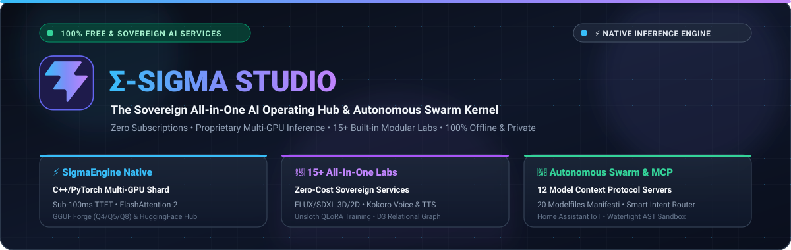
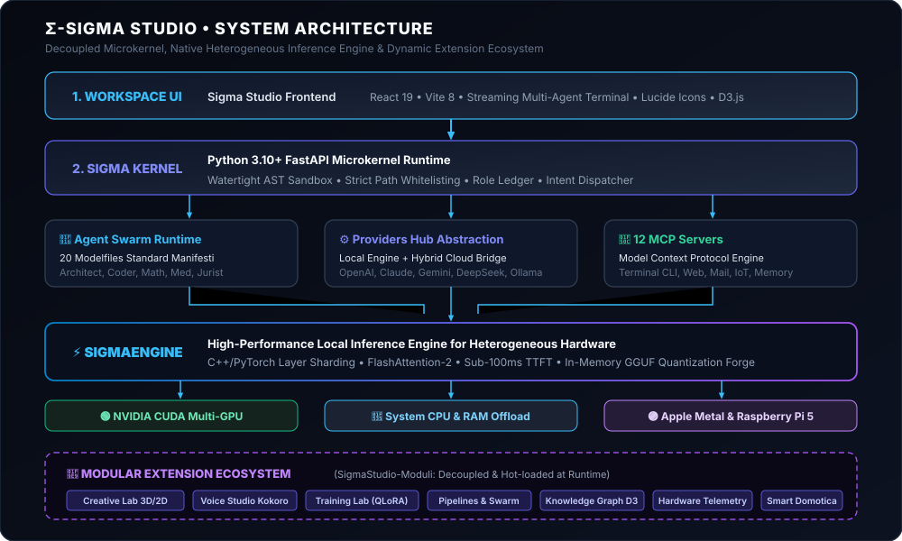

<p align="center">
  <picture>
    <source media="(prefers-color-scheme: dark)" srcset="images/sigma-banner-dark.svg">
    <source media="(prefers-color-scheme: light)" srcset="images/sigma-banner-light.svg">
    
  </picture>
</p>

<p align="center">
  <a href="#-avvio-rapido"></a>
  <a href="#-guarda-sigma-studio-in-azione"></a>
  <a href="https://github.com/Sigmanih/SigmaStudio"></a>
  <a href="https://github.com/Sigmanih/SigmaStudio-Moduli"></a>
  <a href="#-supporta-sigma-studio"></a>
</p>

<p align="center">
  <a href="README.md">🇬🇧 English</a> • 
  <a href="README_IT.md">🇮🇹 Italiano</a> • 
  <a href="#-avvio-rapido">⚡ Avvio Rapido</a> • 
  <a href="#-architettura-di-sistema">🏛️ Architettura</a> • 
  <a href="#-ecosistema-modulare">🧩 Moduli</a> • 
  <a href="https://github.com/Sigmanih/SigmaStudio">📦 GitHub</a>
</p>

<p align="center">
  
  
  
  
  
  
  
  
</p>

---

## 🎬 Guarda Sigma Studio in Azione

https://github.com/user-attachments/assets/3b03d269-f130-4d09-8919-89cb54ee7d0f

> _Esegui modelli locali, connetti agenti, sfrutta strumenti MCP, orchestra workflow ed estendi il sistema sul tuo hardware senza vincoli._

<p align="center">
  <em>▶️ Dimostrazione Live: Chat Multi-Agente in Streaming, Swarm Autonomo, Esecuzione Strumenti MCP e Pipeline Cognitiva Real-Time (<code>chat_record.mp4</code>)</em><br/>
  👉 <strong><a href="https://github.com/Sigmanih/SigmaStudio/blob/main/images/screenshots/chat_record.mp4">Clicca qui per riprodurre il video dimostrativo a schermo intero direttamente sul player di GitHub</a></strong>
</p>

---

## 🚀 Cos'è Sigma Studio?

**Sigma Studio** è un workspace AI modulare che trasforma il tuo hardware locale in un ambiente di sviluppo e orchestrazione di intelligenza artificiale altamente estendibile.

In un'unica interfaccia unificata, senza dover configurare complessi ambienti da riga di comando, puoi:
- 📥 **Scaricare qualsiasi modello**: cerca, scarica e gestisci modelli open-source da Hugging Face o repository GGUF con download multi-stream resiliente.
- 💬 **Chattare in tempo reale**: dialoga con streaming a bassissima latenza con modelli locali (tramite SigmaEngine) o provider cloud (OpenAI, Claude, Gemini, DeepSeek).
- 🎭 **Assegnare ruoli specialistici**: seleziona con un click 20 Modelfile preimpostati (Architetto Software, Programmatore, Matematico, Medico, Giurista, Security Auditor...).
- 🧪 **Testare e benchmarkare**: valuta le prestazioni reali dell'hardware misurando token al secondo, Time-to-First-Token (TTFT) e occupazione VRAM.
- 🧠 **Trainare e fine-tunare**: addestra Small Language Models (SLM) in locale sulla tua GPU con Unsloth QLoRA, PEFT e il motore funzionale Gradus.
- ⚙️ **Quantizzare con la Forgia GGUF**: converti modelli FP16/FP32 nei formati Q4_K_M, Q5_K_M o Q8_0 direttamente in memoria per adattarli alla VRAM disponibile.
- 🔌 **Dotare i modelli di strumenti reali (MCP)**: collega 12 server Model Context Protocol per interagire con file di sistema, terminale, ricerche web live, calendario e domotica IoT in sandbox protetta.

Tutto questo in modo **100% gratuito, privato e sovrano**, senza dipendere da abbonamenti cloud a pagamento.

---

## ⚡ Sigma Studio e SigmaEngine: L'Architettura

Sigma Studio si fonda su una netta separazione architetturale tra l'**ambiente di sviluppo/orchestrazione** e il **motore di inferenza nativo sottostante**:

| Componente | Ruolo e Responsabilità |
|:---|:---|
| **Σ-SIGMA STUDIO** | **Workspace AI e ambiente di orchestrazione** strutturato attorno al Microkernel sicuro di Sigma. Include l'interfaccia React 19, chat streaming multi-agente, governance dei permessi MCP, sandbox di esecuzione AST e iniezione a caldo dei moduli. |
| **⚡ SIGMAENGINE** | **Motore di inferenza locale ad alte prestazioni** per hardware eterogeneo. Gestisce lo sharding automatico dei layer C++/PyTorch su più GPU NVIDIA CUDA, CPU e RAM di sistema, Apple Metal, kernel FlashAttention-2 con TTFT sub-100ms e la Forgia di Quantizzazione GGUF (Q4/Q5/Q8) integrata in-memory. |

---

## ⚖️ Perché Sigma Studio?

| Sfida nell'AI Locale | Soluzione di Sigma Studio |
|:---|:---|
| **I modelli locali sono frammentati** | **Layer unificato di astrazione e provider** (routing trasparente tra pesi locali e API OpenAI, Claude, Gemini, DeepSeek, Groq, Ollama). |
| **I modelli grandi saturano la VRAM di una sola GPU** | **Sharding zero-bottleneck dei layer e offload in RAM** distribuito su più GPU NVIDIA, Apple Silicon o RAM di sistema. |
| **Gli agenti non hanno accesso a tool di sistema** | **Integrazione nativa Model Context Protocol (MCP)** con 12 server inclusi (Terminale CLI, Web live, Email, Domotica IoT, Grafo Memoria). |
| **I workflow AI sono scatole nere imperscrutabili** | **DAG visuale di esecuzione e telemetria in tempo reale**, con monitoraggio dei token in streaming, uso VRAM e autorizzazione granulare dei tool. |
| **I progetti monolitici diventano pesanti e lenti** | **Laboratori modulari disaccoppiati** installabili con un click da [`SigmaStudio-Moduli`](https://github.com/Sigmanih/SigmaStudio-Moduli) senza riavviare il server. |
| **La configurazione hardware varia da utente a utente** | **Esecuzione consapevole delle risorse** ottimizzata sia per workstation multi-GPU che per laptop o schede edge come Raspberry Pi 5. |
| **L'AI locale manca di un vero ambiente di sviluppo** | **Workspace AI sovrano e integrato**: Chat, Forgia GGUF, Fine-Tuning SLM, Generazione 3D/2D, Voce Neurale e Task Kanban. |

---

## 🎯 Progettato per...

- 💻 **Sviluppatori**: Creare applicazioni AI, orchestrare swarm multi-agente, testare server MCP ed eseguire script in sandbox isolata.
- 🔬 **Ricercatori**: Confrontare modelli LLM open-source, sperimentare con il fine-tuning Unsloth QLoRA e testare strategie di partizionamento distribuito.
- ⚡ **Appassionati di AI**: Eseguire modelli all'avanguardia in locale, a costo zero, senza abbonamenti ricorrenti e con privacy assoluta dei dati.
- 🛠️ **Costruttori di Hardware**: Aggregare workstation multi-GPU, RAM di sistema e dispositivi edge in un unico cluster AI reattivo.

---

## 🏛️ Architettura di Sistema

<p align="center">
  <picture>
    <source media="(prefers-color-scheme: dark)" srcset="images/sigma-arch-dark.svg">
    <source media="(prefers-color-scheme: light)" srcset="images/sigma-arch-light.svg">
    
  </picture>
</p>

1. **Livello Workspace UI**: Frontend reattivo in React 19 + Vite 8 con terminali chat in streaming, grafi relazionali D3, viewport 3D in Three.js e telemetria hardware in tempo reale.
2. **Sigma Kernel**: Microkernel leggero in Python 3.10+ FastAPI con sandbox AST per la convalida del codice, whitelist rigida dei percorsi sul disco, instradamento semantico dell'intento e gestione dello stato.
3. **Pilastri di Orchestrazione**:
   - **Swarm di Agenti Autonomi**: 20 manifesti Modelfile standardizzati per ruoli specialistici (Architetto, Sviluppatore, Matematico, Medico, Giurista, Security Auditor, ecc.).
   - **Providers Hub**: Routing interoperabile istantaneo tra il motore locale nativo e le API esterne (OpenAI, Claude, Gemini, DeepSeek, Groq, Ollama).
   - **12 Server MCP**: Standard Model Context Protocol per filesystem, ricerche web live, email, calendario, domotica IoT e gestione VRAM.
4. **SigmaEngine**: Motore esecutivo C++/PyTorch che suddivide i layer tra GPU CUDA, RAM di sistema o Apple Metal tramite FlashAttention-2.
5. **Ecosistema Modulare**: Laboratori e strumenti scaricabili e montabili a caldo dal catalogo ufficiale [`SigmaStudio-Moduli`](https://github.com/Sigmanih/SigmaStudio-Moduli).

---

## 🌟 Funzionalità Chiave & Laboratori Estendibili

### Kernel Base (Incluso nel repository)
- **⚡ Inferenza Locale SigmaEngine**: Sharding multi-GPU, latenza al primo token sub-100ms, streaming KV-cache continuo.
- **🛠️ Hugging Face Downloader & Forgia GGUF**: Convertitore e quantizzatore in-memory integrato (Q4_K_M, Q5_K_M, Q8_0, FP16) per adattare qualsiasi modello alla propria VRAM senza tool da riga di comando.
- **🤖 Swarm Multi-Agente & 20 Modelfiles**: Contratti di ruolo rigorosi e workflow di ragionamento per compiti professionali.
- **🔌 12 Server Model Context Protocol (MCP)**: Esecuzione di comandi di sistema con finestre di autorizzazione interattive.
- **🛡️ Esecuzione Sicura in Sandbox**: Confinamento rigido del filesystem sulle cartelle ammesse (`data/`, `scratch/`, `core/`) con validazione statica AST.

### Laboratori Estendibili (Installabili a caldo con 1 click)
- **🎨 Creative Lab 3D/2D**: Generazione immagini FLUX/SDXL, rimozione sfondo SAM2, generazione mesh 3D Hunyuan3D/TripoSR, materiali PBR.
- **🎙️ Voice Studio & Sintesi Neurale**: Sintesi vocale ultra-rapida Kokoro 82M (<80ms), clonazione vocale zero-shot con XTTS-v2, regolazione fine pitch/velocità.
- **🧠 Training Lab & SLM**: Addestramento locale Unsloth QLoRA, PEFT, Gradus Functional Weight Engine (FWE), ricerca iperparametri Autopilot.
- **🔬 Pipelines Lab & Swarm**: Designer visuale di pipeline DAG, loop di ricerca multi-agente, ispezione step-by-step dell'esecuzione.
- **📊 Argomenti & Grafo di Conoscenza**: Grafo relazionale interattivo force-directed in D3 con ricerca vettoriale RAG.
- **⚡ Hardware & Telemetria GPU**: Monitoraggio allocazione VRAM in tempo reale, processi CUDA attivi, terminazione task zombie e flush VRAM con un click.
- **🏠 Assistente Domotica IoT**: Bridge WebSocket/REST con Home Assistant, automazioni e modulazione climatica/energetica.

---

## 🧩 Ecosistema Modulare

Sigma Studio è progettato per mantenere il kernel ultra-leggero e veloce. Tutte le funzionalità opzionali e i laboratori specializzati sono distribuiti come moduli indipendenti nel repository dedicato:

<p align="center">
  <a href="https://github.com/Sigmanih/SigmaStudio-Moduli">
    
  </a>
</p>

Tutti i moduli possono essere installati con un solo click direttamente dalla scheda **Hub Skills & Estensioni** nell'interfaccia di Sigma Studio, senza riavviare il server.

---

## ⚡ Avvio Rapido

Nessuna installazione o configurazione manuale complessa: dipendenze, virtual environment, rilevamento hardware e build del frontend vengono **gestiti e installati in automatico al primo avvio**.

### 1. Clona il Repository
```bash
git clone https://github.com/Sigmanih/SigmaStudio.git
cd SigmaStudio
```

### 2. Avvia la Piattaforma (Auto-Setup in 1 Click)
- **Windows**:
  ```powershell
  .\sigma_studio.bat
  ```
- **Linux / macOS / Raspberry Pi**:
  ```bash
  chmod +x sigma_studio.sh
  ./sigma_studio.sh
  ```

> 💡 *Al primissimo lancio, Sigma Studio crea in autonomia l'ambiente virtuale `.venv`, installa i pacchetti necessari, configura il runtime nativo di inferenza, compila il frontend se necessario e apre automaticamente `http://localhost:8000`.*

#### ⚙️ Opzioni Avanzate del Launcher
- Forza la reinstallazione o aggiornamento dipendenze: `.\sigma_studio.bat --install` (o `./sigma_studio.sh --install`)
- Diagnostica dell'ambiente senza avviare il server: `.\sigma_studio.bat --check` (o `./sigma_studio.sh --check`)
- Ispezione acceleratori e hardware rilevato: `python sigma_launcher.py --info`

### 🖥️ Matrice Hardware e Piattaforme Supportate

Sigma Studio è ingegnerizzato per operare su qualsiasi architettura, dai cluster workstation multi-GPU ai single-board computer a basso consumo:

| Piattaforma | Architettura | Acceleratori e Compute | Modelli Consigliati | Comando di Avvio |
|:---|:---|:---|:---|:---|
| **Workstation Windows** | `x86_64` (Windows 10/11) | NVIDIA CUDA (RTX 30xx/40xx), Vulkan, CPU | Qualsiasi dimensione (0.5B – 70B+) | `.\sigma_studio.bat` |
| **Server & Desktop Linux** | `x86_64` (Ubuntu / Debian / Arch) | NVIDIA Multi-GPU, AMD ROCm, Intel SYCL, CPU | Qualsiasi dimensione (0.5B – 70B+) | `./sigma_studio.sh` |
| **Mac Apple Silicon** | `arm64` (M1 / M2 / M3 / M4) | Apple Metal (Memoria Unificata fino a 128GB+) | Da 0.5B a 32B+ Q4_K_M | `./sigma_studio.sh` |
| **Raspberry Pi 5 / 4** | `aarch64` (Debian Bookworm 64-bit) | Broadcom Quad-Core ARM Cortex-A76 (NEON) | SLM da 0.5B a 3B (Qwen 2.5, Llama 3.2, SmolLM2) | `./sigma_studio.sh` |
| **PC & Laptop CPU-Only** | `x86_64` / `arm64` | Intel / AMD AVX2/AVX-512, Snapdragon X | Modelli quantizzati da 0.5B a 7B (Q4_K_M) | `.\sigma_studio.bat` / `./sigma_studio.sh` |

> 🍓 **Ottimizzato per Raspberry Pi 5**: Su distribuzioni Linux aarch64, `./sigma_studio.sh` rileva in automatico l'architettura ARM, scarica il set di ruote PyTorch per CPU alleggerite, configura il runtime nativo aarch64 ed esegue i moderni SLM (Small Language Models) senza bisogno di alcuna configurazione manuale.

---

## 🧪 Test Automatizzati e Verifica

Esegui la suite di test Pytest del kernel:
```bash
pytest tests/ -v
```
Tutti i test del kernel convalidano la governance MCP, il routing degli agenti, gli endpoint FastAPI, l'isolamento della sandbox e lo streaming chat con il 100% di successo.

---

## 💙 Supporta Sigma Studio

Sigma Studio è sviluppato come progetto open-source sovrano e indipendente. Se trovi la piattaforma utile per la tua ricerca, i tuoi workflow o il tuo homelab, puoi supportare la continuità dello sviluppo:

<p align="center">
  <a href="https://www.paypal.com/ncp/payment/RP2DYUXVJ8FRC">
    
  </a>
  <br/>
  <small><em>Il tuo contributo sostiene direttamente le ottimizzazioni multi-GPU, nuovi ruoli open-source e lo sviluppo di strumenti AI liberi e sovrani.</em></small>
</p>

---

## 📜 Licenza & Community

Sigma Studio è software open source distribuito con doppia licenza:
- **GNU Affero General Public License v3 (AGPL-3.0)** per la community open source, sviluppatori e ricercatori.
- **Licenza Commerciale** per installazioni aziendali, integrazioni proprietarie e soluzioni SaaS a codice chiuso.

Consulta il file [LICENSE](file:///LICENSE) per i termini completi di licenza e i contatti per licenze commerciali.

- [CONTRIBUTING.md](file:///CONTRIBUTING.md) — Linee guida per i contributi e termini CLA
- [SECURITY.md](file:///SECURITY.md) — Politica di segnalazione vulnerabilità e sicurezza
- [CODE_OF_CONDUCT.md](file:///CODE_OF_CONDUCT.md) — Codice di condotta Contributor Covenant v2.1
- [Repository GitHub](https://github.com/Sigmanih/SigmaStudio) — Repository ufficiale e aggiornamenti