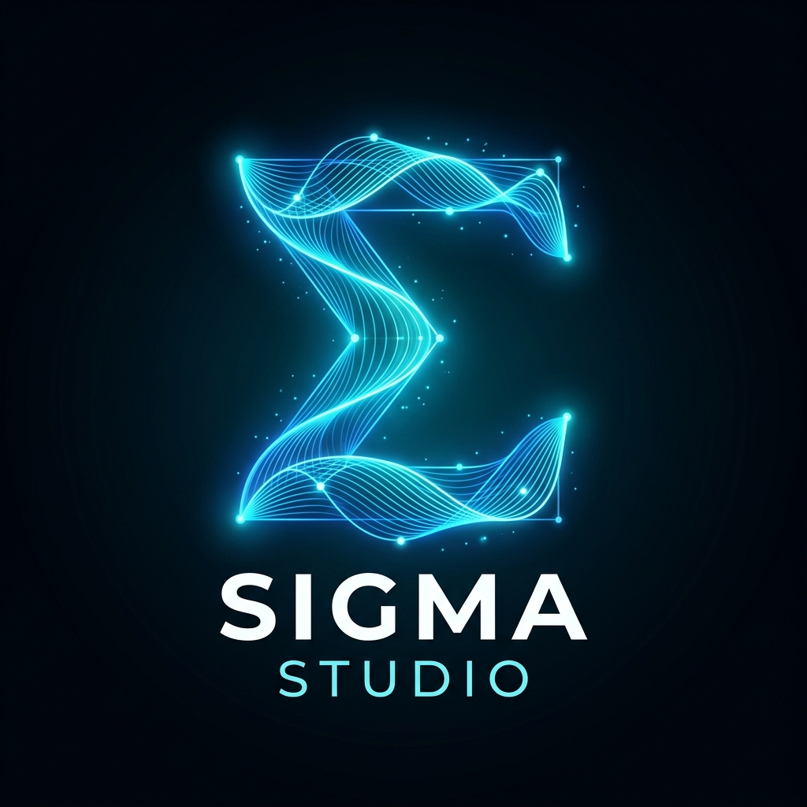
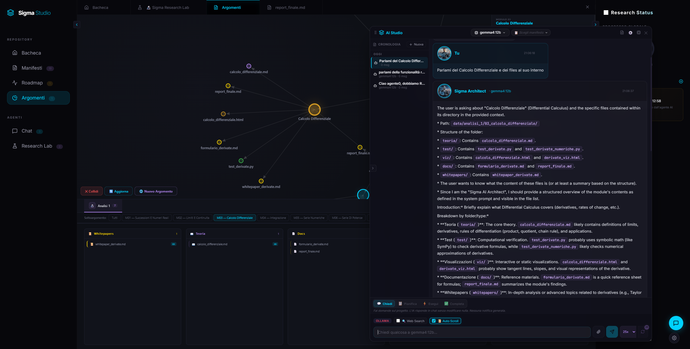

<p align="center">
  
</p>

<h1 align="center">🧬 Σ-SIGMA Studio</h1>

<p align="center">
  <strong>Kernel Operativo Cognitivo Modulare AI-Native per Inferenza Multi-GPU, Swarm Multi-Agente Autonomi ed Ecosistema Modulare Dinamico</strong>
</p>

<p align="center">
  <a href="https://www.python.org"></a>
  <a href="https://react.dev"></a>
  <a href="https://fastapi.tiangolo.com"></a>
  <a href="https://developer.nvidia.com/cuda-zone"></a>
  <a href="https://modelcontextprotocol.io"></a>
  <a href="https://github.com/Sigmanih/SigmaStudio"></a>
</p>

<p align="center">
  <a href="README.md">🇬🇧 English</a> • <a href="README_IT.md">🇮🇹 Italiano</a> • <a href="https://github.com/Sigmanih/SigmaStudio">📦 Repository GitHub</a>
</p>

---

## 📸 Screenshot della Piattaforma

<p align="center">
  
</p>
<p align="center"><em>1. Bacheca Rilasci Dinamica, Slider Showcase delle Skills & Pipeline Operativa Kernel a 4 Step</em></p>

<p align="center">
  
</p>
<p align="center"><em>2. Workspace Chat AI in Streaming con Latenza Sub-100ms, SigmaEngine Multi-GPU & 12 Server MCP</em></p>

<p align="center">
  
</p>
<p align="center"><em>3. Modelli Hub: Hugging Face Downloader Integrato & Forgia di Quantizzazione GGUF (Tab 2)</em></p>

---

## 🚀 Panoramica

**Sigma Studio** è un sistema operativo cognitivo open-source progettato attorno a un **Micro-Kernel** a camere stagne affiancato da un **Ecosistema Modulare Runtime ad Iniezione a Caldo**. Combina un backend in **Python 3.10+ FastAPI** ad elevate prestazioni con un frontend reattivo in **React 19 + Vite 8**.

I team di agenti AI cooperano tramite manifesti Modelfile vincolanti, strumenti operativi Model Context Protocol (MCP) e laboratori specializzati scaricabili e montabili a caldo senza riavviare il server.

```
+-----------------------------------------------------------------------------------------+
|                                KERNEL COGNITIVO Σ-SIGMA STUDIO                          |
+-----------------------------------------------------------------------------------------+
|  ⚡ SigmaEngine (Multi-GPU CUDA) |  ⚙️ Providers Hub (100% Interoperabile) |  📜 20 Modelfiles  |
|  (C++/PyTorch FlashAttn-2 Shard) |  (OpenAI, Claude, Gemini, DeepSeek)   |  (Manifesti Hub)  |
+-----------------------------------------------------------------------------------------+
|                              🔌 12 SERVER MODEL CONTEXT PROTOCOL                        |
+-----------------------------------------------------------------------------------------+
|  🛠️ Dev / Workspace  |  🌐 Web Search & DNS |  ✉️ Client Email |  💬 Telegram / Slack  |
|  📅 Calendario Task  |  🧠 Memoria Vettoriale|  🏠 IoT HomeAss  |  ⚡ GPU VRAM Flush    |
+-----------------------------------------------------------------------------------------+
|                              🧩 15 SKILLS & LABORATORI OPEN SOURCE                      |
+-----------------------------------------------------------------------------------------+
| 🎨 Creative Lab 3D/2D      | 🧠 Training Lab & SLM     | 🎙️ Voice Studio (Kokoro)      |
| 🔬 Pipelines Lab & Swarm   | ⚡ Hardware & Telemetria  | 🏠 Assistente Domotica IoT     |
| 📅 Roadmap & Task Audit    | 📊 Grafo Memoria D3       | 📻 Hi-Fi Audio Lounge          |
+-----------------------------------------------------------------------------------------+
```

---

## 🌟 Architettura & Funzionalità Chiave

### 1. ⚡ SigmaEngine: Inferenza Nativa Ottimizzata Multi-Piattaforma
- **Sharding Intelligente C++/PyTorch**: Distribuisce automaticamente i layer dei modelli LLM (da 0.5B a 70B+) tra le GPU disponibili, Apple Silicon Metal o core CPU e RAM di sistema per prevenire la saturazione VRAM.
- **TTFT Sub-100ms**: Latenza minima al primo token con kernel FlashAttention-2 nativi e streaming continuo dei blocchi KV-cache.

### 2. ⚡ Modelli Hub: Hugging Face Downloader & Forgia GGUF (Tab 2)
- **Hugging Face Downloader**: Cerca, filtra e scarica qualsiasi modello open-source direttamente da Hugging Face con ripresa automatica del download in streaming.
- **Convertitore & Forgia GGUF (Tab 2)**: Quantizzazione integrata in locale nel formato ideale (Q4_K_M, Q5_K_M, Q8_0, FP16) per ottimizzare l'uso della VRAM senza dipendenze CLI esterne.

### 3. ⚙️ Providers Hub: Routing e Interoperabilità Totale
- Possibilità di scegliere e commutare istantaneamente tra il motore nativo locale SigmaEngine e i Providers Cloud preferiti (**OpenAI GPT-4o, Anthropic Claude 3.5, Google Gemini 2.0 Flash, DeepSeek-R1, Groq, Ollama**).
- Centralino semantico locale ultrarapido (~100ms) per l'analisi dell'intento e il dispatching automatico verso l'agente o provider più idoneo.

### 4. 📜 Manifesti Hub: 20 Ruoli Disciplinari Standardizzati
- Regole di condotta, vincoli etici e formati di risposta standardizzati per 20 figure specialistiche (Architetto Software, Sviluppatore, Matematico, Medico, Giurista, Auditor di Sicurezza, ecc.).

### 5. 🔌 12 Server Model Context Protocol (MCP)
- **Server Kernel Nativi**: Developer CLI & Pytest, Web Search live, Email Manager, Notifiche Telegram/Slack, Calendario, Fallback di Inferenza.
- **Server MCP Modulari**: Home Assistant IoT, Monitor Hardware NVML & VRAM Flush, Sintesi Vocale Neurale, Grafo Memoria RAG, Training QLoRA.
- **Governance dei Permessi**: Dialoghi interattivi di approvazione granulare prima dell'esecuzione di comandi critici di sistema.

### 6. 🏛️ Isolamento e Sicurezza a Camere Stagne
- **Whitelist Rigorosa dei Percorsi**: Operazioni sul filesystem confinate unicamente alle directory consentite (`data/`, `manifesti/`, `scratch/`, `sigma_studio/`, `core/`).
- **Sandbox di Esecuzione**: Validazione statica AST per prevenire l'esecuzione di codice arbitrario non verificato.

---

## 📦 Catalogo Moduli Ufficiali

Tutti i moduli opzionali possono essere scaricati gratuitamente con 1 click dall'**Hub Skills & Estensioni**:

| ID Modulo | Nome | Categoria | Funzionalità Principali |
|:---|:---|:---|:---|
| [`sigma_creative_lab`](https://github.com/Sigmanih/SigmaStudio-Moduli/tree/main/modules/sigma_creative_lab) | **Creative Lab 3D/2D** | Multimodale & Grafica | Text-to-Image (FLUX/SDXL), scontorno SAM2/rembg, generazione 3D (Hunyuan3D/TripoSR), materiali PBR, rendering Blender headless. |
| [`sigma_training_lab`](https://github.com/Sigmanih/SigmaStudio-Moduli/tree/main/modules/sigma_training_lab) | **Training Lab & SLM** | Fine-Tuning & SLM | Unsloth QLoRA, PEFT, Gradus Functional Weight Engine (FWE), Autopilot iperparametri, quantizzazione GGUF, benchmark MMLU. |
| [`sigma_voice_studio`](https://github.com/Sigmanih/SigmaStudio-Moduli/tree/main/modules/sigma_voice_studio) | **Voice Studio & Audio** | Voce Neurale & Audio | Kokoro 82M ultra-veloce (<80ms), Coqui XTTS-v2 zero-shot cloning, regolazione pitch/speed, waveform live, Voice MCP. |
| [`sigma_hardware_lab`](https://github.com/Sigmanih/SigmaStudio-Moduli/tree/main/modules/sigma_hardware_lab) | **Hardware & Telemetria GPU** | Sistema & VRAM | Telemetria real-time VRAM/GPU/CPU, gestione processi CUDA, terminazione zombie e flush memoria video con 1 click. |
| [`sigma_research_lab`](https://github.com/Sigmanih/SigmaStudio-Moduli/tree/main/modules/sigma_research_lab) | **Pipelines Lab & Swarm** | Ricerca & Automazione | Visual designer nodi DAG, loop di ricerca multi-agente, ispezione step-by-step ed auto-correzione codice (self-healing). |
| [`sigma_knowledge`](https://github.com/Sigmanih/SigmaStudio-Moduli/tree/main/modules/sigma_knowledge) | **Argomenti & Grafo Memoria** | Conoscenza & Memoria | Grafo relazionale D3 force-directed, esploratore Universal Knowledge Nodes, ricerca semantica RAG, Memory MCP. |
| [`sigma_roadmap`](https://github.com/Sigmanih/SigmaStudio-Moduli/tree/main/modules/sigma_roadmap) | **Roadmap & Kanban Task** | Produttività & Attività | Calendario interattivo, lavagna Kanban drag-and-drop, audit log cronologico, milestone manager. |
| [`sigma_domotica`](https://github.com/Sigmanih/SigmaStudio-Moduli/tree/main/modules/sigma_domotica) | **Assistente Domotica Smart** | IoT & Domotica | Bridge WebSocket/REST Home Assistant, controllo dispositivi, trigger automazioni, modulazione carichi energetici. |

---

## ⚡ Installazione & Avvio Rapido

### Prerequisiti
- **Sistema Operativo**: Windows 10/11 o Linux x86_64
- **Python**: 3.10 o superiore
- **Node.js**: 18.0+ e npm 9.0+
- **CUDA Toolkit** (Consigliato per accelerazione hardware): NVIDIA CUDA 12.0+

### 1. Clonare il Repository
```bash
git clone https://github.com/Sigmanih/SigmaStudio.git
cd SigmaStudio
```

### 2. Setup Automatico (Windows)
Fai doppio clic su `install_dependencies.bat` o esegui:
```powershell
.\install_dependencies.bat
```

### 3. Setup Manuale (Linux / macOS)
```bash
# 1. Crea e attiva l'ambiente virtuale
python -m venv .venv
source .venv/bin/activate  # Su Windows: .venv\Scripts\activate
pip install -r requirements.txt

# 2. Compila il Frontend
cd sigma_studio
npm install
npm run build
cd ..

# 3. Avvia il Server
python sigma_server.py
```

### 4. Avvio di Sigma Studio
Avvia con un clic da Windows:
```powershell
.\sigma_studio.bat
```
Oppure manualmente da terminale:
```bash
python sigma_server.py
```
Accedi dal browser su **`http://localhost:8000`**.

---

## 🧪 Esecuzione Suite di Test

Esegui la suite completa di test automatizzati con Pytest:
```bash
pytest tests/ -v
```
Tutti i test del kernel verificano la governance MCP, il routing agenti, le API FastAPI, la sandbox e lo streaming chat con il 100% di successo.

---

## 📜 Licenza & Aggiornamenti
Sigma Studio è rilasciato sotto licenza **Apache-2.0**. Nuove funzionalità ed ottimizzazioni del kernel vengono rilasciate con frequenza costante sul [Repository GitHub Ufficiale](https://github.com/Sigmanih/SigmaStudio).