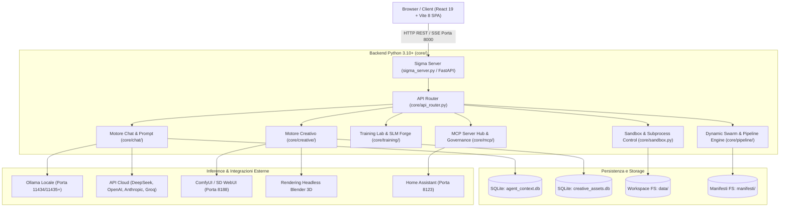
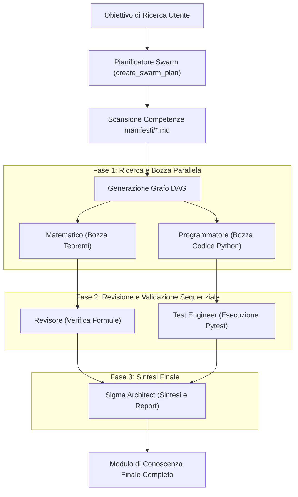
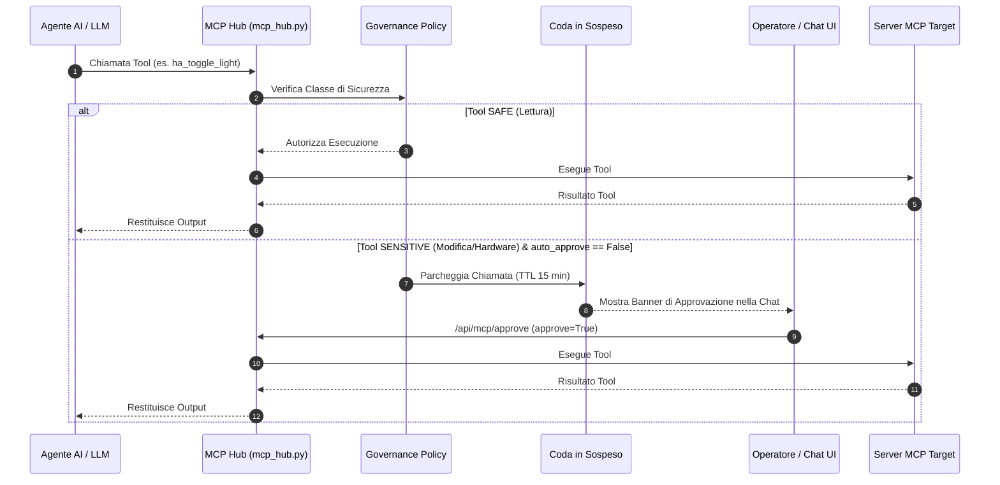
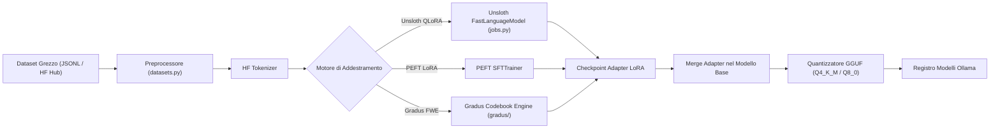

# 🧬 Σ-SIGMA Studio — Architettura Tecnica & Specifica di Sistema

**Versione**: 8.0 / 6.2 Refactored  
**Stato**: Sistema Eseguibile Reale  
**Stack Tecnologico**: Python 3.10+ (FastAPI / Uvicorn), React 19, Vite 8, PyTorch, Unsloth, HuggingFace, KaTeX, D3.js  

---

## 1. 🌐 Principi Architetturali

Sigma Studio è strutturato secondo cinque principi guida:

1. **Il Codice Eseguibile come Autorità**: La documentazione rispecchia rigorosamente il codice sorgente in esecuzione. Le configurazioni, i manifesti degli agenti e i file del workspace sono oggetti eseguibili o parsabili.
2. **Disaccoppiamento Modulare**: Il backend (`core/`) è organizzato in moduli isolati per dominio (`chat`, `creative`, `mcp`, `orchestration`, `pipeline`, `training`, `tts`, `integrations`) coordinati da un router centralizzato (`core/api_router.py`).
3. **Sicurezza Sandbox su Percorsi Autorizzati**: L'esecuzione degli agenti, le modifiche ai file e gli script di test sono confinati entro whitelist rigide (`core/sandbox.py`) ed esecuzioni isolate con timeout (`core/sandbox_manager.py`).
4. **Interoperabilità Governata tramite MCP**: Gli strumenti esterni, i dispositivi hardware e i servizi interagiscono esclusivamente tramite server MCP (Model Context Protocol) con approvazione umana per le chiamate sensibili.
5. **Esecuzione Adattiva rispetto all'Hardware**: Il motore monitora costantemente VRAM, RAM e carico GPU/CPU per adattare la precisione dei modelli, la dimensione dei batch e l'offloading della memoria KV.

---

## 2. 🏛️ Architettura Generale del Sistema



---

## 3. 💻 Architettura Frontend (`sigma_studio/`)

### 3.1 Stack e Tecnologie
- **Framework**: React 19 (`react`, `react-dom` v19.2.4)
- **Build Tool**: Vite 8 (`vite` v8.0.4)
- **Stili**: Vanilla CSS (`src/index.css`) con token glassmorphism e tema scuro `#0e1016`.
- **Rendering e Visualizzazione**:
  - `KaTeX` (`katex.min.css`): Rendering Formule Matematiche inline ($...$) e display ($$...$$).
  - `Mermaid.js`: Grafi di flusso e diagrammi di sequenza.
  - `D3.js` (`d3` v7.9.0): Grafo relazionale interattivo della conoscenza (`MappaArgomenti.jsx`, `TopicGraph.jsx`).
  - `Prism.js` (`prismjs` v1.30.0) + `react-simple-code-editor`: Editing codice con evidenziazione sintassi.
  - `Three.js` (`three` v0.185.1): Viewport 3D per mesh ed asset creativi.

### 3.2 Struttura dei Componenti Frontend

```text
App (App.jsx)
 ├── AppProvider (AppContext.jsx)
 ├── Sidebar (Sidebar.jsx) - Navigazione Argomenti, Moduli, Contatori
 ├── Workspace (Workspace.jsx) - Contenitore Multi-Tab
 │    ├── McpStatusBar - Stato dei Server MCP in Tempo Reale
 │    └── Componenti delle Schede:
 │         ├── WelcomeDashboard (Bacheca, Spiegazione Kernel Cognitivo, Primi Passi)
 │         ├── SigmaLabEditor (Editor MD, LaTeX, Python, Anteprime HTML)
 │         ├── ImageViewer (Visualizzatore immagini con Zoom, Pan, Sfondo Scacchiera)
 │         ├── ManifestiGallery (Galleria Modelfile Agenti)
 │         ├── ModuleView (Esploratore Sezioni Modulo: teoria, test, viz, docs)
 │         ├── ResearchLabTab (Orchestrazione e Roadmap del Team di Agenti)
 │         ├── CreativeStudio (Text2Img, 3D, Materiali, Video UI)
 │         ├── TrainingLab (Unsloth QLoRA, Autopilota, Forgia SLM, Benchmarks)
 │         ├── HardwareLab (Monitor VRAM, Processi GPU e Kill PID)
 │         ├── McpHubTab (12 Server MCP, Console JSON-RPC, Governance)
 │         ├── SkillsHub (Attivazione Skill e Integrazione App)
 │         └── AccountTab (Profilo Utente e Preferenze Voce TTS)
 ├── Pannelli Fluttuanti:
 │    ├── ChatPanel (Overlay Chat AI, Selezione Provider, Audio TTS/STT)
 │    ├── TaskFloatingPanel (Overlay Gestione Task)
 │    └── HardwareFloatingPanel (Mini Monitor GPU/CPU Overlay)
 └── Modali e Notifiche:
      ├── ImageLightbox (Zoom Immagini Full-Screen)
      ├── AIConfig (Impostazioni API & Provider)
      └── ToastNotification (Sistema di Allerte)
```

---

## 4. ⚙️ Architettura Backend (`sigma_server.py` + `core/`)

### 4.1 Server FastAPI & Lifecycle (`core/fastapi_app.py`)
- **Server Web**: FastAPI su Uvicorn (`0.0.0.0:8000`).
- **Sequenza di Avvio (`_startup_sequence`)**:
  1. Configurazione hardware multi-GPU (`_apply_hardware_env()`).
  2. Verifica compilazione frontend (`sigma_studio/dist/`).
  3. Indicizzazione metadati workspace (`rebuild_modules_meta()`).
  4. Inizializzazione modello intent router `sigma-router`.
  5. Riconciliazione job di training orfani su GPU (`reconcile_active_jobs()`).

### 4.2 Tabella Completa Endpoint API (`core/api_router.py`)

#### Endpoint HTTP GET
| Percorso | Funzione Handler | Descrizione |
|:---|:---|:---|
| `/api/modules` | `handle_api_modules` | Restituisce la struttura dei moduli e file. |
| `/api/topics` | `handle_api_topics` | Restituisce la gerarchia degli argomenti. |
| `/api/tasks` | `handle_api_tasks_get` | Restituisce i task della roadmap. |
| `/api/get_file` | `handle_get_file` | Legge il contenuto di un file nel workspace. |
| `/api/list_manifesti` | `handle_list_manifesti` | Elenca i Modelfile degli agenti in `manifesti/`. |
| `/api/knowledge_db` | `handle_knowledge_db` | Restituisce l'albero relazionale della conoscenza. |
| `/api/config` | `handle_api_config_get` | Restituisce la configurazione di sistema. |
| `/api/ollama_models` | `handle_api_ollama_models` | Elenca i modelli presenti in Ollama. |
| `/api/agents` | `handle_agents_list` | Elenca gli agenti registrati e le metriche. |
| `/api/research/list` | `handle_research_list` | Elenca le sessioni di ricerca attive. |
| `/api/training/datasets` | `handle_training_list_datasets` | Elenca i dataset di addestramento locali. |
| `/api/training/jobs` | `handle_training_list_jobs` | Elenca lo stato dei job di fine-tuning. |
| `/api/training/hardware` | `handle_training_hardware` | Telemetria hardware GPU/VRAM/RAM. |
| `/api/hardware/status` | `handle_hardware_status` | Statistiche di utilizzo risorse di sistema. |
| `/api/mcp/servers` | `handle_mcp_servers` | Elenca i server MCP integrati ed esterni. |
| `/api/mcp/tools` | `handle_mcp_tools` | Aggrega tutti i tool MCP disponibili. |
| `/api/creative/assets` | `handle_creative_assets` | Elenca gli asset del caveau creativo. |
| `/api/creative/backends/status` | `handle_creative_backends_status` | Stato di ComfyUI, SD WebUI e Blender. |

#### Endpoint HTTP POST
| Percorso | Funzione Handler | Descrizione |
|:---|:---|:---|
| `/api/chat` | `handle_chat` | Genera risposte LLM in streaming SSE. |
| `/api/chat/orchestrate` | `handle_chat_orchestrate` | Avvia l'orchestrazione parallela multi-agente. |
| `/api/swarm/plan` | `handle_swarm_plan` | Genera il grafo DAG per lo swarm di agenti. |
| `/api/swarm/execute` | `handle_swarm_execute` | Esegue lo swarm di agenti in parallelo. |
| `/api/create_file` | `handle_create_file` | Crea un file autorizzato nel workspace. |
| `/api/run_test` | `handle_run_test` | Esegue script di test Python nella Sandbox. |
| `/api/mcp/rpc` | `handle_mcp_rpc` | Gateway JSON-RPC 2.0 per tool MCP. |
| `/api/mcp/approve` | `handle_mcp_approve` | Approva una chiamata MCP sensibile in sospeso. |
| `/api/training/job/create` | `handle_training_job_create` | Configura un nuovo job di addestramento. |
| `/api/training/job/start` | `handle_training_job_start` | Avvia il processo di addestramento in background. |
| `/api/training/benchmark/run` | `handle_training_benchmark_run` | Avvia la valutazione benchmark ufficiale. |
| `/api/creative/generate` | `handle_creative_generate` | Genera immagini (Text-to-Image / Img2Img). |
| `/api/creative/3d` | `handle_creative_3d` | Genera mesh 3D (GLB/OBJ). |
| `/api/creative/render` | `handle_creative_render` | Rende una scena 3D tramite Blender headless. |

---

## 5. 🤖 Orchestrazione Swarm & Agenti

### Pianificazione Swarm DAG (`core/pipeline/dynamic_swarm.py`)



---

## 6. 🔌 Sub-sistema MCP & Governance

### Workflow Governance Sicurezza (`core/mcp/governance.py`)



---

## 7. 🔬 Training Lab & Fine-Tuning Engine

### Pipeline di Addestramento



---

## 8. 🎨 Creative Engine & Grafico degli Asset

### Schema del Caveau Creativo (`data/creative/creative_assets.db`)
- Tabella `assets`: ID asset, tipo (immagine, mesh, materiale, video), nome, thumbnail, metadati JSON.
- Tabella `asset_versions`: Cronologia versioni, percorsi file (albedo, normal, mesh, render) e parametri.
- Tabella `asset_edges`: Tracciamento della discendenza DAG (asset padre -> asset derivato).

---

## 9. 🔒 Modello di Sicurezza e Sandbox

- **Whitelist dei Percorsi (`core/sandbox.py`)**: `_is_path_allowed()` limita l'accesso ai file solo a percorsi whitelisted (`data/`, `manifesti/`, `scratch/`, `sigma_studio/`, `core/`).
- **Validazione AST del Codice**: Il codice Python generato dagli agenti viene analizzato con `ast.parse()` prima di essere eseguito.
- **Isolamento Subprocessi**: L'esecuzione di comandi avviene con `shlex.split`, senza `shell=True` e con timeout rigorosi.

---

## 10. 📊 Matrice delle Funzionalità Implementate vs Programmate

| Componente di Sistema | Implementato | Parziale | Programmato | Evidenza |
|:---|:---:|:---:|:---:|:---|
| **Backend FastAPI ASGI** | ✅ | | | `core/fastapi_app.py` |
| **Frontend React 19 SPA** | ✅ | | | `sigma_studio/src/App.jsx` |
| **AI Multi-Provider (Ollama/Cloud)** | ✅ | | | `core/ai_providers.py` |
| **12 Server MCP Integrati** | ✅ | | | `core/mcp/*.py` |
| **Integrazione Home Assistant** | ✅ | | | `core/mcp/homeassistant_server.py` |
| **Orchestratore Swarm DAG** | ✅ | | | `core/pipeline/dynamic_swarm.py` |
| **Fine-Tuning Unsloth & SLM Forge** | ✅ | | | `core/training/jobs.py`, `forge.py` |
| **Gradus FWE Weight Generator** | ✅ | | | Pacchetto `gradus/` |
| **Caveau Asset Creativi SQLite** | ✅ | | | `core/creative/asset_graph.py` |
| **Blender 3D Headless Rendering** | ✅ | | | `core/creative/three_d/blender_bridge.py` |
| **Viewer Immagini In-Chat e Tab** | ✅ | | | `src/components/Workspace/ImageViewer.jsx` |
| **Rotte RESTful DELETE/PATCH** | | ⚠️ | | `core/api_router.py:L287` (Stubs) |
| **Container Docker & Compose** | | | ❌ PROGRAMMATO | Nessun `Dockerfile` presente |
| **Pipeline CI/CD GitHub Actions** | | | ❌ PROGRAMMATO | Nessun `.github/workflows` presente |
| **Supporto Nativo Raspberry Pi 5 / ARM64** | | | ❌ PROGRAMMATO | Nessun manifesto ARM64 nativo |