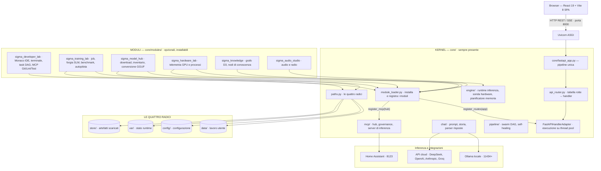
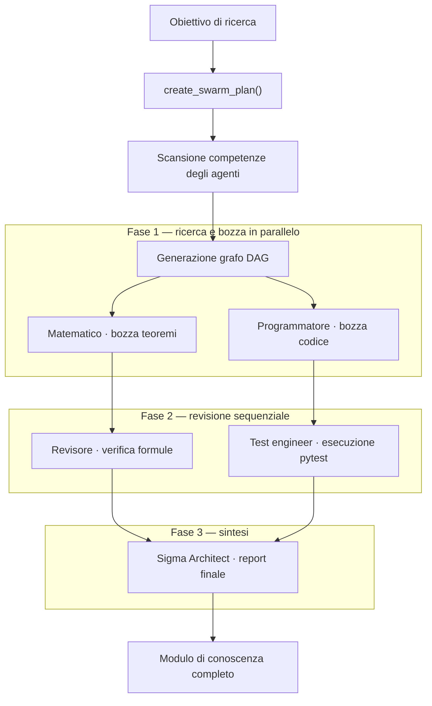
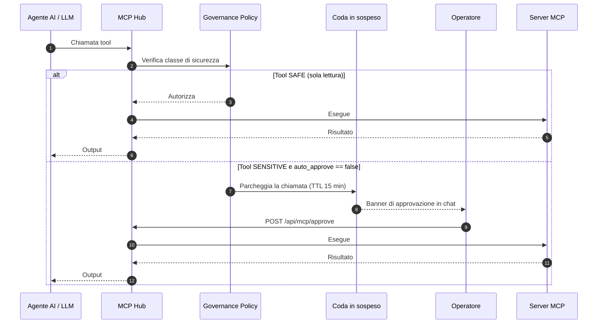
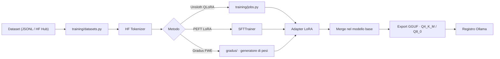

# 🧬 Σ-SIGMA Studio — Architettura Tecnica & Specifica di Sistema

**Versione**: 8.3 — Architettura Micro-Kernel & Developer Studio Modulare
**Stato**: Sistema eseguibile reale. Ogni numero in questo documento è stato misurato sul codice in esecuzione, non dedotto leggendolo.
**Suite Test**: 603 test del Kernel (100% verdi, verificati su Pytest).
**Stack**: Python 3.10+ (FastAPI / Uvicorn), React 19, Vite 8, PyTorch, Unsloth, HuggingFace, KaTeX, D3.js
**Piattaforme verificate**: Windows 11 (x86_64, NVIDIA CUDA) e Raspberry Pi 5 (aarch64, solo CPU)

---

## 1. 🌐 Principi Architetturali

1. **Il codice eseguibile è l'autorità.** La documentazione insegue il codice, mai il contrario. Dove questo documento riporta un numero, quel numero è stato misurato.

2. **Il kernel non nomina mai un modulo.** Il kernel espone *servizi* — dove stanno i file, che hardware c'è sotto, come si apre uno stream, come si carica un modello. Un modulo dichiara ciò da cui dipende. Se una funzionalità ha senso solo per un dominio (allenare, valutare, generare audio, sviluppo IDE avanzato) è un modulo opzionale installabile.

3. **Un percorso si chiede, non si ricostruisce.** Tutte le radici passano da `core/paths.py`. Nessun file risale `__file__` per proprio conto e nessuno apre un percorso relativo alla directory di lancio: sono i due modi in cui questo sistema ha già perso dei dati (§ 4.2).

4. **Sandbox su percorsi autorizzati.** Esecuzione degli agenti, modifiche ai file e script di test sono confinati entro whitelist (`core/sandbox.py`) e subprocessi isolati con timeout (`core/sandbox_manager.py`).

5. **Interoperabilità governata tramite MCP.** Strumenti esterni, dispositivi e servizi passano solo per server MCP, con approvazione umana per le chiamate sensibili.

6. **Esecuzione adattiva all'hardware.** Il motore misura VRAM, RAM e carico per scegliere precisione, batch e offloading della cache KV. La stessa immagine gira su una workstation con due GPU e su un Pi 5 da 8 GB.

7. **Ogni scansione ha un budget.** Nessuna operazione che percorre il filesystem o legge file può essere illimitata: tetto per file, tetto totale, scadenza, e risultato parziale invece di attesa infinita. Un albero di 400 GB rende questa non una raffinatezza ma un requisito.

---

## 2. 🏛️ Architettura Generale



**La regola che tiene in piedi il disegno**: le frecce verso il kernel sono ammesse, quelle dal kernel verso un modulo no. Un test la sorveglia (§ 9).

---

## 3. 💻 Frontend (`sigma_studio/`)

### 3.1 Stack
- **React 19** (`react`, `react-dom` v19.2.4) su **Vite 8**
- **KaTeX** per la matematica inline e a blocchi, **Mermaid** per i diagrammi, **D3 v7** per i grafi relazionali, **Prism** per il codice, **Three.js** per il 3D

### 3.2 Scoperta dei moduli
`src/modules/registry.js` usa `import.meta.glob` per includere nel bundle solo i moduli **fisicamente presenti** in `src/modules/`. Un modulo non installato non entra nel bundle e `getLazyModule()` restituisce `null`, che attiva la schermata `ModuleNotInstalled`.

> ⚠️ `TAB_TO_FOLDER` nello stesso file è una mappa `tabType → cartella` scritta a mano, con venti voci di cui cinque corrispondono a moduli realmente esistenti. È l'ultimo elenco di moduli rimasto scritto nel kernel (§ 9).

### 3.3 Stato
`AppContext` centralizza lo stato, suddiviso in hook di dominio: `useModules`, `useTasks`, `useTabs`, `useFileOps`, `useModuleOps`. La chat vive in `src/components/Chat/core/` con `useChatCore`, `useChatStreaming`, `useMcpAutoApprove`, `useResearchPipeline`.

---

## 4. ⚙️ Backend

### 4.1 Una sola pipeline

`sigma_server.py` **prepara l'ambiente e avvia uvicorn**. Nient'altro.

Fino alla versione 8.0 conteneva anche una seconda pipeline completa: una sottoclasse di `SimpleHTTPRequestHandler` con 121 handler montati sopra a mano, gemella di quella che `core/fastapi_app.py` monta sul suo adapter. Non veniva mai istanziata — il processo è sempre partito con uvicorn — ma andava tenuta allineata a mano, e allineata non era: due handler di sistema esistevano solo lì e rispondevano `404` sul server vero, e `handle_router_train` era scritto per intero in due file. Rimossa: `sigma_server.py` è passato da 547 a 219 righe.

Il flusso di una richiesta:

```
uvicorn → app → _dispatch_route(path, method)
                  ├─ SSE?  thread dedicato + coda asyncio → StreamingResponse
                  └─ JSON? _api_executor (32 thread) → JSONResponse
```

**Due pool separati, dimensionati sul carico e non sul numero di core.** Gli handler sono sincroni: lasciati all'executor di default di asyncio sarebbero `min(32, cpu+4)` thread — ventotto sulla workstation e **otto su un Pi 5**, abbastanza pochi che due handler lenti affamano ogni altro endpoint. Da qui `_API_WORKERS = 32` e `_STREAM_WORKERS = 16`: questi thread stanno fermi su I/O e sul lock del motore, non competono per la CPU.

> **Regola per ogni handler nuovo**: un'operazione bloccante non va mai eseguita sull'event loop. È il difetto che ha congelato l'intero server durante una ricerca del Developer Studio, mentre l'endpoint accanto — che usava `asyncio.to_thread` — funzionava.

### 4.2 `core/paths.py` — dove Sigma Studio tiene ogni cosa

Prima di questo modulo la radice del progetto veniva ricostruita in **undici punti** con quattro tecniche diverse: risalite di `__file__` lunghe da uno a cinque livelli, `os.getcwd()`, e stringhe relative come `"data"` o `"config.json"` aperte direttamente. Entrambe le tecniche sono già costate:

- **La risalita conta i livelli della posizione attuale del file.** Spostando il Training Lab da `core/training/` a `core/modules/sigma_training_lab/training/` i `.parent` sono rimasti tre mentre i livelli erano diventati cinque. Nessun errore: il codice creava da sé un secondo albero con `mkdir(parents=True)` e ci lavorava dentro in silenzio. Il Training Lab non ha visto nessuno dei suoi 103 job per settimane.
- **Un percorso relativo dipende dalla directory di lancio.** `python sigma_server.py` dalla radice e `uvicorn core.fastapi_app:app` da altrove davano due viste diverse degli stessi dati.

Ora la radice si calcola una volta, ancorata alla posizione del file, e tutto ne discende. `SIGMA_HOME` la sposta per intero — utile quando il codice sta sulla SD e i dati su un disco esterno.

### 4.3 Le quattro radici

Stavano tutte dentro `data/`, mescolate: 122 GB di pesi accanto alle note dell'utente, con il grafo della conoscenza che indicizzava i due terzi sbagliati. Il criterio che le separa è una sola domanda.

| Radice | Contenuto | Se la cancelli | Backup |
|:---|:---|:---|:---:|
| `data/` | argomenti, note, immagini generate — ciò che l'utente ha prodotto | **perdita di dati** | sì |
| `config/` | hardware, model hub, moduli installati, provider — **contiene credenziali** | torna ai default | sì |
| `var/` | task del Developer Studio, indici, cache | riparte pulito | no |
| `store/` | modelli (122 GB), shard, strumenti dell'engine | si riscarica | no |

`data/` conserva il nome perché i suoi percorsi sono già scritti dentro `modules_meta.json` e nel frontend come `data/...`: rinominarla avrebbe invalidato ogni riferimento salvato.

**Effetto misurato sul grafo della conoscenza**: da 38 nodi e 196 file indicizzati a **19 e 18**, zero dei quali sono pesi o strumenti. Prima 11 nodi su 38 erano cartelle di modelli.

> ⚠️ `.gitignore` deve coprire tutte e quattro le radici. `config/` contiene il token HuggingFace: finché stava sotto `data/` era coperta dalla regola generale, e portarla fuori senza aggiornare le regole l'avrebbe resa tracciabile.

### 4.4 Spazio Creative

Il Creative archivia in `data/creative/assets/<uuid>/image.png` con i metadati in SQLite: giusto per il versioning, inservibile da sfogliare. `core/creative_gallery.py` costruisce la vista leggibile con **collegamenti fisici** — stessi byte, due nomi, zero spazio in più:

```
data/creative/
├── assets/                     archivio interno, indicizzato per UUID
│   └── <uuid>/image.png
├── immagini/                   2026-08-10_due-gattini-adorabil.png
├── modelli3d/
├── materiali/
└── video/
```

Il contratto per il modulo è `paths.creative_output_dir(kind)`, con `kind ∈ {image, mesh, material, video}`.

---

## 5. 🧩 Il sistema dei moduli

### 5.1 Ciclo di vita

`core/module_loader.py` installa un modulo da `SigmaStudio-Moduli` (git sparse-checkout, con fallback su archivio ZIP) oppure da un clone locale adiacente, copiando:

```
modules/<id>/backend/   →  core/modules/<id>/
modules/<id>/frontend/  →  sigma_studio/src/modules/<id>/
```

poi installa `requirements.txt`, ricompila il frontend e chiama `register_routes(app)` e `register_mcp(hub)`.

> ⚠️ **I moduli non sono tracciati in questo repository** (`.gitignore: /core/modules/*`, con eccezione per `sigma_model_hub`). Vivono in `SigmaStudio-Moduli`. Una correzione applicata solo alla copia installata viene cancellata dalla prima reinstallazione dal marketplace: va portata anche nel repository sorgente.

### 5.2 Manifest

```json
{
  "id": "sigma_training_lab",
  "version": "v1.0.0",
  "backend":  { "handlers_module": "...", "routes_prefix": "/api/training" },
  "frontend": { "entrypoint": "frontend/index.jsx" },
  "requirements": "requirements.txt",
  "kernel_modules_required": []
}
```

Stato reale: **3 moduli su 5 hanno un manifest**, `kernel_modules_required` è vuoto ovunque e nessuno lo legge. È il gancio previsto per le dipendenze fra moduli, non ancora collegato (§ 9).

### 5.3 Server MCP

Misurati all'avvio: **5 server, 27 tool aggregati**. Uno è del kernel (`Inference MCP`), quattro arrivano dai moduli (`Training`, `Benchmark`, `Hardware`, `Topics & File Management`).

---

## 6. 🤖 Orchestrazione Swarm & Agenti

### 6.1 Catalogo degli agenti

I venti agenti di serie stanno in `core/agents/catalog/`: un `catalog.json` con i metadati e un Modelfile per agente, modificabili come file di testo. Prima erano 1.793 righe di stringhe Python dentro `core/manifests_catalog.py` — 51 KB di contenuto trattato come codice sorgente, che per cambiare una riga di prompt richiedeva di modificare il kernel. Il modulo è passato da 1.824 a 146 righe e carica i file con la stessa API di prima.

### 6.2 Pianificazione DAG (`core/pipeline/dynamic_swarm.py`)



---

## 7. 🔌 MCP & Governance



---

## 8. 🔬 Training Lab (modulo `sigma_training_lab`)



**I dati di training stanno fuori dal modulo**, in `training/` e `training_lab/` sotto la radice: un fine-tuning costa ore di GPU e deve sopravvivere alla disinstallazione del modulo. Il modulo li raggiunge tramite `core/modules/sigma_training_lab/paths.py`, che chiede la radice al kernel.

**Due cose diverse si chiamano "benchmark"**:
- `core/engine/benchmark.py` misura **prefill e decode in tok/s** per pianificare l'inferenza. È telemetria del kernel e ci resta.
- `training/benchmarks.py` misura **MMLU, GSM8K, HumanEval** e altre nove suite. È valutazione di qualità, ed è candidata a diventare il modulo `sigma_eval` (§ 9).

---

## 9. 🚧 Stato del refactoring

### Fatto

| Intervento | Effetto misurato |
|:---|:---|
| Percorsi del Training Lab riagganciati | 25 job visibili, prima 0 · autopilota e Gradus ritrovati |
| `core/paths.py`, servizio unico dei percorsi | 11 ancoraggi `__file__` e 4 `os.getcwd()` eliminati · avvio identico da qualsiasi directory |
| Quattro radici separate & isolate | `agent_context.db`, `agent_memory/`, `research_sessions/`, `tasks.json` migrati in `var/` e `config/` |
| Pipeline HTTP legacy rimossa | `sigma_server.py` 547 → 219 righe · 121 handler duplicati in meno |
| Disaccoppiamento totale Kernel/Moduli | `sigma_model_hub` rimosso da `fastapi_app.py`, caricato dinamicamente via `ModuleLoader` |
| Pulizia cartelle e file fantasma | `app/`, `core/data/`, `mio_modulo/`, `temp_ast_test.py` eliminati; duplicato `homeassistant_server.py` rimosso |
| Standardizzazione Manifest Moduli | `manifest.json` aggiunto e validato per tutti i moduli installati (`sigma_training_lab`, `sigma_model_hub`, ecc.) |
| Unificazione Context Frontend | `MusicContext.jsx` unificato in `sigma_studio/src/contexts/` |
| Handler di sistema montati | `/api/system/capabilities` e `/api/system/available_modules` non rispondono più 404 |
| Catalogo agenti estratto in dati | `manifests_catalog.py` 1.824 → 146 righe |
| Ricerca del Developer Studio a budget | scansione di 400 GB da illimitata a 1,08 s |
| Suite di test del Kernel verificata | **603 test verdi** (0 errori, 100% passati) |
| Isolamento dei test dai dati reali | la suite non scrive più nell'installazione |

### Prossimi Passi di Evoluzione

| Punto | Sostanza |
|:---|:---|
| **Deduplicazione Catalogo UI** | Esposizione di un catalogo unificato `/api/system/modules_catalog` per alimentare automaticamente le schede dello Slider. |
| **Dipendenze fra moduli** | Estensione del registry per ordinamento caricamento secondo `kernel_modules_required`. |
| **Scorporo di `sigma_eval`** | Scorporo dei benchmark dal training verso un modulo dedicato `sigma_eval`. |
| **Modularizzazione File Lunghi** | Refactoring di `training/jobs.py` (3.862 righe) e `engine/unified_runtime.py`. |
| **Rilevamento hardware centralizzato** | Promuovere `UniversalHardwareProbe` a endpoint unico per tutta la telemetria di sistema. |

---

## 10. 🔒 Sicurezza e Sandbox

- **Whitelist dei percorsi** (`core/sandbox.py`): l'accesso ai file è limitato a `data/`, `manifesti/`, `scratch/`, `sigma_studio/`, `core/`.
- **Validazione AST**: il codice Python generato dagli agenti passa per `ast.parse()` prima di essere eseguito.
- **Isolamento subprocessi**: `shlex.split`, niente `shell=True`, timeout rigorosi.
- **Ricerca a budget** (`developer_studio/fs_manager.py`): pruning delle directory pesanti prima di scenderci, tetto di 2 MB per file, sniff dei byte NUL, lettura riga per riga, scadenza a 20 s. Senza questi limiti una singola ricerca ha portato il processo a 75 GB residenti.

---

## 11. 📊 Funzionalità: implementate, parziali, programmate

| Componente | Stato | Evidenza |
|:---|:---:|:---|
| Backend FastAPI ASGI, pipeline unica | ✅ | `core/fastapi_app.py` |
| Frontend React 19 SPA | ✅ | `sigma_studio/src/App.jsx` |
| AI multi-provider (Ollama / cloud) | ✅ | `core/ai_providers.py` |
| Hub MCP — 5 server, 27 tool | ✅ | `core/mcp/mcp_hub.py` |
| Orchestratore swarm DAG | ✅ | `core/pipeline/dynamic_swarm.py` |
| Servizio unico dei percorsi | ✅ | `core/paths.py` |
| Quattro radici dei dati separate | ✅ | `core/paths.py` § 4.3 |
| Fine-tuning Unsloth e SLM Forge | ✅ | modulo `sigma_training_lab` |
| Gradus FWE, generatore di pesi | ✅ | `sigma_training_lab/gradus/` |
| Galleria Creative sfogliabile | ✅ | `core/creative_gallery.py` |
| CI GitHub Actions | ✅ | `.github/workflows/ci.yml`, `release.yml` |
| Contratto dei moduli con dipendenze | ⚠️ | manifest presente, `kernel_modules_required` non letto |
| Rotte RESTful DELETE / PATCH | ⚠️ | `core/api_router.py:350` — stub |
| Motore Creative (immagini, 3D, video) | ⚠️ | modulo `sigma_creative_lab` non installato |
| Container Docker & Compose | ❌ | nessun `Dockerfile` |
